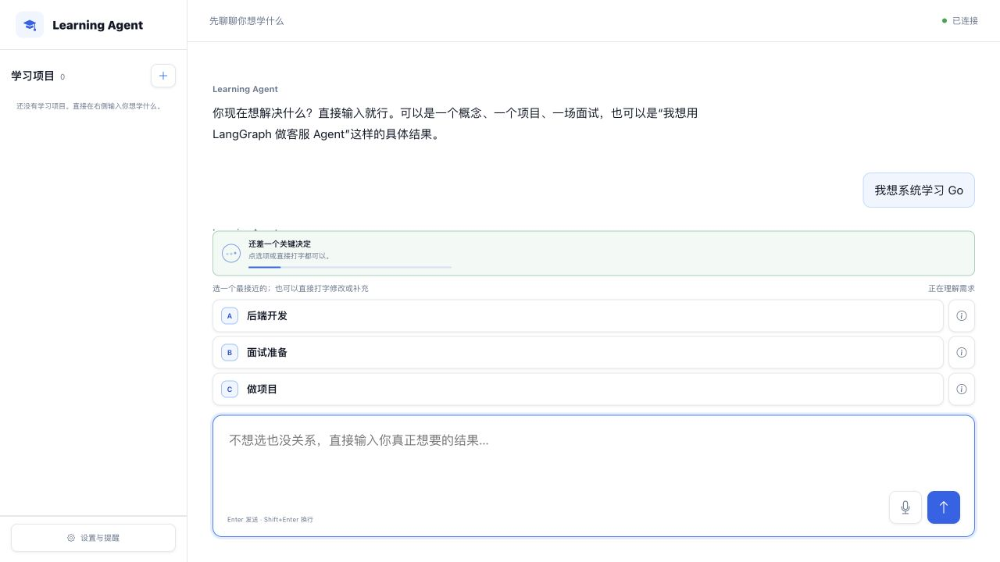
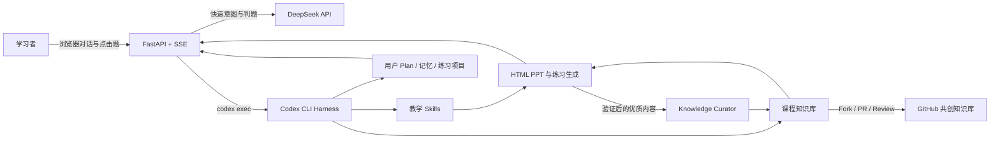
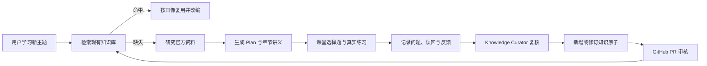

<div align="center">
  

  <h1>Learning Agent</h1>

  <p><strong>一个会先理解你，再为你规划、讲解、练习、复习并持续生长知识库的 Agentic AI 学习系统。</strong></p>

  <p>
    <a href="README.md">简体中文</a> ·
    <a href="README_EN.md">English</a>
  </p>

  <p>
    <a href="https://github.com/yyz666ai/Learning-Agent/actions"></a>
    <a href="https://www.python.org/"></a>
    <a href="https://fastapi.tiangolo.com/"></a>
    <a href="https://developers.openai.com/codex/cli/"></a>
    <a href="LICENSE"></a>
  </p>

  <p>
    <a href="#-快速开始">快速开始</a> ·
    <a href="#-核心能力">核心能力</a> ·
    <a href="#-系统架构">系统架构</a> ·
    <a href="#-完整安装教程">安装教程</a> ·
    <a href="#-知识库共创与-pr">知识库共创</a>
  </p>
</div>

---

## 项目介绍

Learning Agent 不是“把问题发给大模型，再显示一段答案”的普通聊天页面。它把 **Codex CLI 当作 Agent harness**，把教学规则写成可版本管理的 **Skills**，把知识内容拆成可复用的 **知识原子与课程路线**，再通过 FastAPI 将计划、HTML PPT、选择题、代码练习、复习卡片和对话答疑串成一条完整学习流程。

系统会先识别用户究竟是想：

- 快速理解一个概念；
- 从零系统学习一门语言或框架；
- 看懂并接手一个真实项目；
- 针对面试题进行系统训练；
- 从已有基础继续精进，最终完成大型项目。

不同目标会进入不同的 Plan、教学深度、题型与复习节奏。已经验证有效的讲义、例子、误区和题目可以沉淀回公共知识库，后续用户直接复用，并通过 GitHub PR 继续完善。

<div align="center">
  
  <p><sub>对话优先的学习入口：动态意图识别、紧凑选择题与持久学习项目。</sub></p>
</div>

## 核心能力

| 能力 | 说明 |
|---|---|
| Agentic Onboarding | 从自由输入开始做意图识别与 slot filling，只追问真正影响 Plan 的信息 |
| 个性化 Plan | 根据目标、基础、时间和最终成果生成详细 `plan.md`，用户确认后才开始课程 |
| 自适应 HTML PPT | 按知识密度决定页数，逐页讲解、Markdown/代码高亮、Mermaid 流程图与页面内行动提示 |
| 课堂与课后分离 | 课堂使用可点击选择题检验理解；课后练习留在真实项目目录，可继续在对话框答疑 |
| 真实代码实践 | 自动建立课程项目结构，代码包含中文注释，可直接使用 Cursor、Trae 或其他编辑器打开 |
| 学习进度与题库 | 大纲、选择题、错题、作业、面试题和掌握状态统一记录 |
| Anki 式复习 | 支持“没想起来 / 有点困难 / 顺利”复习反馈与间隔复习卡片 |
| 面试题库 | 收集无答案面试题，系统讲解、扩展关联问题并跟踪掌握情况 |
| 知识库自生长 | 将完成并复核的课程沉淀为知识原子、讲义缓存、路线和误区，减少重复生成 |
| 流式交互 | FastAPI + SSE 流式返回 Agent 消息与生成状态，长任务持续显示进度和阶段 |

## 系统架构



### 三层目录与读写边界

| 层 | 目录 | 内容 | 权限 |
|---|---|---|---|
| Codex Runtime | `userdir/u_<id>/.codex-runtime/home/` | 每位用户独立的 Codex 配置和会话状态 | 运行时读写，Git 忽略 |
| Teaching Workspace | `workspace/dev/` → `workspace/releases/current/` | `AGENTS.md`、Skills、知识库、教学政策 | dev 可维护，release 运行时只读 |
| Learner Data | `userdir/u_<id>/` | 画像、Plan、进度、题库、笔记、练习项目 | 仅该用户运行时读写，Git 忽略 |

> 本项目没有修改 Codex 源码。它是在 Codex CLI 外增加 FastAPI、前端、教学 Workspace 和用户数据层，并用独立 `CODEX_HOME` 让每位学习者拥有隔离的模型配置与记忆。

## 快速开始

```bash
git clone https://github.com/yyz666ai/Learning-Agent.git
cd Learning-Agent/learning-agent-server

python3 -m venv .venv
source .venv/bin/activate
python -m pip install -r requirements.txt

cp .secrets.env.example .secrets.env
# 编辑 .secrets.env，填入 DEEPSEEK_API_KEY

python -m backend.publish
./run.sh
```

浏览器打开：<http://127.0.0.1:8787>

### 用户数据什么时候创建？

仅打开首页时，后端只读取状态，不会创建一个没有内容的空用户目录。用户确认 onboarding 学习目标，或第一次触发需要 Codex 的学习操作后，系统会按 URL 中的 `user_id` 自动创建独立目录：

```text
http://127.0.0.1:8787/?user_id=alice
→ learning-agent-server/userdir/u_alice/
```

其中会持续保存画像、`plan.md`、课程进度、讲义、题库、笔记、练习项目，以及该用户隔离的 `.codex-runtime/home/config.toml`。关闭网页或重启服务不会清除这些内容；`userdir/` 已被 Git 忽略。

> 当前 `user_id` 是本地学习档案标识，不是登录鉴权。公开部署前必须增加真实账号认证、会话管理和租户隔离。

## 完整安装教程

### 1. 准备基础环境

建议环境：

- macOS 或 Linux；Windows 建议使用 WSL 2；
- Git；
- Python 3.10 或更高版本；
- 可访问 DeepSeek API；
- Codex CLI。

检查版本：

```bash
git --version
python3 --version
```

### 2. 安装 Codex CLI

按照 [Codex CLI 官方文档](https://developers.openai.com/codex/cli/)，macOS / Linux 可以使用官方安装器：

```bash
curl -fsSL https://chatgpt.com/codex/install.sh | sh
codex --version
```

Learning Agent 使用 `codex exec` 作为 Agent harness。项目运行时会给 Codex 注入单独的 `CODEX_HOME` 和 DeepSeek provider，因此不会覆盖你个人的 `~/.codex/config.toml`。

如果你还要在终端单独使用 OpenAI Codex，可运行：

```bash
codex login
codex login status
```

Codex 官方支持 ChatGPT 登录和 API Key 登录；参见 [Authentication](https://developers.openai.com/codex/auth/)。仅运行本项目的 DeepSeek provider 时，核心凭据是下一步配置的 `DEEPSEEK_API_KEY`。

### 3. 克隆项目

```bash
git clone https://github.com/yyz666ai/Learning-Agent.git
cd Learning-Agent/learning-agent-server
```

### 4. 创建 Python 环境

```bash
python3 -m venv .venv
source .venv/bin/activate
python -m pip install --upgrade pip
python -m pip install -r requirements.txt
```

Windows WSL 使用相同命令。原生 Windows PowerShell 尚不是当前脚本的主要支持路径。

### 5. 配置 DeepSeek API

先在 [DeepSeek 开放平台](https://platform.deepseek.com/) 创建 API Key。不要把 Key 发到聊天、写入前端代码或提交到 Git。

复制安全配置示例：

```bash
cp .secrets.env.example .secrets.env
chmod 600 .secrets.env
```

编辑 `.secrets.env`：

```dotenv
DEEPSEEK_API_KEY=your_real_deepseek_api_key
```

#### 为什么 API Key 不放前端？

浏览器代码对所有访问者可见，放在前端会直接泄露密钥。本项目采用后端注入：

1. FastAPI 后端读取 `.secrets.env`；
2. `backend/codex_driver.py` 启动 `codex exec`；
3. Key 通过进程环境变量 `DEEPSEEK_API_KEY` 注入；
4. `templates/codex-home-config.toml` 只保存 `env_key` 名称，不保存真实 Key；
5. 首次创建用户时，模板自动复制到该用户隔离的 `CODEX_HOME`；
6. `.secrets.env`、`userdir/` 和运行时配置全部被 Git 忽略。

这意味着用户只需填写一个后端配置文件，不需要在网页中粘贴密钥，也不需要手工修改每个用户的 Codex 配置。

### 6. 选择 Codex 模型配置

默认模板位于：

```text
learning-agent-server/templates/codex-home-config.toml
```

当前默认配置：

```toml
model = "deepseek-v4-flash"
model_provider = "deepseek"

[model_providers.deepseek]
name = "DeepSeek"
base_url = "https://api.deepseek.com/v1"
env_key = "DEEPSEEK_API_KEY"
wire_api = "responses"
```

- `deepseek-v4-flash`：用于 onboarding、结构化意图识别等低延迟场景；
- `deepseek-v4-pro`：适合需要更深入推理的课程研究或复杂教学规划；
- 新用户会自动获得模板副本；
- 已创建用户的配置位于 `userdir/u_<id>/.codex-runtime/home/config.toml`，该目录不会上传 GitHub。

根据 [Codex 配置参考](https://developers.openai.com/codex/config-reference/)，provider 级配置属于用户级配置。Learning Agent 使用独立 `CODEX_HOME` 正是为了安全隔离这部分配置，而不是把 provider 写进公开的项目级 `.codex/config.toml`。

### 7. 发布教学 Workspace

运行时不直接读取可写的 `workspace/dev`，而是读取发布快照：

```bash
python -m backend.publish
```

该命令会根据 `workspace/dev/manifest.json` 的白名单生成：

```text
workspace/releases/current/
```

发布目录是运行产物，不提交 Git。

### 8. 启动服务

```bash
./run.sh
```

指定其他端口：

```bash
./run.sh 9000
```

打开：

```text
http://127.0.0.1:8787
```

健康检查：

```bash
curl http://127.0.0.1:8787/api/health
```

FastAPI 接口文档：<http://127.0.0.1:8787/api/docs>

### 9. 可选：命令行学习模式

先确保已经发布 Workspace，然后运行：

```bash
./chat.sh demo-user
```

作者维护 Skills 和知识库时可运行：

```bash
./dev.sh author
```

## 中英文切换

- 中文文档：[`README.md`](README.md)
- English documentation: [`README_EN.md`](README_EN.md)

当前仓库提供完整的中英文项目文档切换。产品界面目前以中文教学体验为主；请不要把 README 的语言切换误认为前端已经完成全量国际化。欢迎通过 PR 补充 UI i18n。

## 知识库与 Skills

Learning Agent 将“怎么教”和“教什么”分开管理：

```text
workspace/dev/
├── .codex/skills/       # 教学方法：意图识别、Plan、讲义、出题、复习、策展
├── curriculum/          # 教学内容：知识原子、概念图、学习路线、库/框架
├── references/          # 教学政策、状态边界、提示与复习政策
├── memory/              # 状态 Schema 和空模板，不含真实用户数据
├── tools/               # 校验、发布、状态写入和知识检索工具
└── AGENTS.md            # Workspace 总路由与安全边界
```

### 知识库的自生长闭环



## 知识库共创与 PR

我们希望把知识库建设成由学习者、教师和工程师共同维护的开放教学体系。可以贡献：

- 新语言、框架或工具的知识原子；
- 更清晰的讲解、类比和 Mermaid 图；
- 更好的课堂选择题、课后练习和面试题；
- 常见误区、调试经验和真实项目案例；
- 新的学习路线；
- 教学 Skills、行为评测与质量规则。

### 推荐 PR 流程

首次向 GitHub 推送前，推荐使用 GitHub CLI 的浏览器授权，不要在终端输入 GitHub 账号密码：

```bash
brew install gh        # macOS；其他系统参见 https://cli.github.com/
gh auth login          # 选择 GitHub.com → HTTPS → Login with a web browser
gh auth status         # 确认当前账号
```

GitHub 已停止 Git 的密码认证；浏览器授权、Personal Access Token 或 SSH Key 才是受支持的命令行认证方式。

```bash
# 1. Fork 后克隆自己的仓库
git clone https://github.com/<your-name>/Learning-Agent.git
cd Learning-Agent

# 2. 建立分支
git checkout -b curriculum/add-java-generics

# 3. 修改知识库或 Skill
# workspace/dev/curriculum/...
# workspace/dev/.codex/skills/...

# 4. 校验 Workspace
cd learning-agent-server
.venv/bin/python workspace/dev/tools/validate_workspace.py

# 5. 运行测试
.venv/bin/python -m pytest -q

# 6. 提交并发起 PR
git add workspace/dev tests
git commit -m "curriculum: add Java generics learning atoms"
git push origin curriculum/add-java-generics
```

详细规范见 [`CONTRIBUTING.md`](CONTRIBUTING.md) 和 [`workspace/dev/curriculum/ATOMS.md`](learning-agent-server/workspace/dev/curriculum/ATOMS.md)。

## 项目目录

```text
Learning-Agent/
├── README.md / README_EN.md
├── CONTRIBUTING.md
├── docs/assets/                    # Logo 与公开产品截图
└── learning-agent-server/
    ├── frontend/                   # 零依赖 SPA：对话、PPT、题库、设置
    ├── backend/                    # FastAPI、Codex bridge、Plan/课程/复习逻辑
    ├── templates/                  # 每用户 Codex 配置模板
    ├── workspace/dev/              # Skills、知识库、策略、Schema、工具
    ├── projects/                   # 可公开的完整练习项目
    ├── tests/                      # 后端、前端契约与教学规则测试
    ├── tools/                      # 评测辅助工具
    ├── run.sh / chat.sh / dev.sh
    └── .secrets.env.example
```

## 测试与质量检查

```bash
cd learning-agent-server

# 完整测试
.venv/bin/python -m pytest -q

# Skills、Schema、概念图与课程结构校验
.venv/bin/python workspace/dev/tools/validate_workspace.py

# 重新生成只读发布快照
.venv/bin/python -m backend.publish
```

## 安全边界

- 不提交 `.secrets.env`、真实 API Key 或 Token；
- 不提交 `userdir/` 中的画像、对话、题库、笔记和代码；
- 不把 API Key 放入前端 JavaScript、URL、命令行参数或 `config.toml`；
- `workspace/releases/` 是本地发布产物，不是知识库源文件；
- 本地运行默认面向可信单机环境；公开部署前应进一步收紧 Codex sandbox、网络访问、身份认证与租户隔离；
- 发现安全问题时请不要在公开 Issue 中附带密钥或真实用户数据。

## 常见问题

<details>
<summary><strong>页面提示“没有找到 Codex 命令行”</strong></summary>

确认：

```bash
which codex
codex --version
```

如果不存在，请重新执行官方安装命令，并重开终端。
</details>

<details>
<summary><strong>课程一直处于准备中</strong></summary>

依次检查：

```bash
curl http://127.0.0.1:8787/api/health
test -f .secrets.env && echo "secret file exists"
test -d workspace/releases/current && echo "workspace published"
```

注意：不要打印真实 Key。查看服务终端中的错误类型即可。
</details>

<details>
<summary><strong>修改了 Skill，但网页没有变化</strong></summary>

修改的是 `workspace/dev`，运行时读取的是发布快照。重新执行：

```bash
python -m backend.publish
```

再重启服务。
</details>

<details>
<summary><strong>可以换成其他模型提供商吗？</strong></summary>

可以，但需要该 provider 与当前 Codex wire API 兼容，同时还要调整轻量直连调用 `backend/llm.py`。不要只改前端，也不要把 provider 密钥写进仓库。建议先增加独立 provider 配置、契约测试和健康检查，再提交 PR。
</details>

## 路线图

- [ ] 完成前端中英文 i18n；
- [ ] 增加更多语言、框架和工程项目知识原子；
- [ ] 增加知识原子自动质量评分与 PR 检查；
- [ ] 支持可插拔模型 provider；
- [ ] 增加 Docker 与受限 sandbox 部署方案；
- [ ] 建设社区题库、面试题库与课程版本治理。

## License

本项目基于 [MIT License](LICENSE) 发布。

---

<div align="center">
  <strong>Learning Agent — 一步一步，真正学会。</strong>
  <br />
  如果这个项目对你有帮助，欢迎 Star、提交 Issue，或贡献第一份知识库 PR。
</div>
