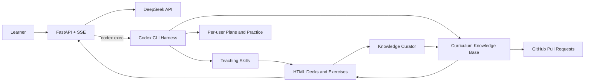

<div align="center">
  

  <h1>Learning Agent</h1>

  <p><strong>An agentic learning system that understands the learner, builds a plan, teaches through interactive decks, guides practice, schedules review, and grows a reusable knowledge base.</strong></p>

  <p>
    <a href="README.md">简体中文</a> ·
    <a href="README_EN.md">English</a>
  </p>

  <p>
    
    
    
    <a href="LICENSE"></a>
  </p>
</div>

---

## What is Learning Agent?

Learning Agent is more than a chat wrapper. It uses **Codex CLI as the agent harness**, version-controlled **Skills as teaching policies**, and reusable **knowledge atoms and learning paths as curriculum**. FastAPI connects those layers to a conversation-first web interface with personalized plans, interactive HTML slide decks, clickable quizzes, real code projects, review cards, interview practice, and persistent learner progress.

The initial intent router distinguishes between concept clarification, systematic beginner learning, codebase onboarding, interview preparation, and advanced project-based learning. Each route receives a different plan, depth, question style, practice format, and review schedule.

<div align="center">
  
</div>

## Highlights

- Free-text intent recognition with multi-turn slot filling.
- A detailed `plan.md` is shown and confirmed before lessons begin.
- Adaptive HTML decks with Markdown, highlighted code, Mermaid diagrams, and page-level actions.
- Clickable in-class quizzes plus separate after-class coding assignments.
- Real project folders that can be opened in Cursor, Trae, or another editor.
- Unified outline, practice bank, error history, interview bank, and mastery state.
- Anki-style review ratings and spaced review cards.
- Knowledge curation that turns verified lessons into reusable public assets.
- FastAPI SSE streaming with visible progress for long-running generation.

## Architecture



The project does **not** modify Codex source code. It wraps Codex CLI with a FastAPI bridge, a teaching workspace, a frontend, and isolated per-user runtime directories.

## Quick start

### Prerequisites

- macOS or Linux; Windows users should use WSL 2.
- Git and Python 3.10+.
- Codex CLI.
- A DeepSeek API key.

### 1. Install Codex CLI

The [official Codex CLI documentation](https://developers.openai.com/codex/cli/) recommends the standalone installer on macOS and Linux:

```bash
curl -fsSL https://chatgpt.com/codex/install.sh | sh
codex --version
```

For regular OpenAI Codex use, authenticate with `codex login`. Learning Agent itself starts Codex with an isolated `CODEX_HOME` configured for DeepSeek.

### 2. Clone and install

```bash
git clone https://github.com/yyz666ai/Learning-Agent.git
cd Learning-Agent/learning-agent-server

python3 -m venv .venv
source .venv/bin/activate
python -m pip install --upgrade pip
python -m pip install -r requirements.txt
```

### 3. Configure the API key

Create an API key in the [DeepSeek Platform](https://platform.deepseek.com/). Never send the key through chat, place it in frontend code, or commit it to Git.

```bash
cp .secrets.env.example .secrets.env
chmod 600 .secrets.env
```

Edit `.secrets.env`:

```dotenv
DEEPSEEK_API_KEY=your_real_deepseek_api_key
```

The key stays on the server. The backend reads it, launches `codex exec`, and injects the key through the process environment. The browser never receives it. The public provider template stores only the environment variable name:

```toml
model = "deepseek-v4-flash"
model_provider = "deepseek"

[model_providers.deepseek]
name = "DeepSeek"
base_url = "https://api.deepseek.com/v1"
env_key = "DEEPSEEK_API_KEY"
wire_api = "responses"
```

The template is copied into each learner's isolated `userdir/u_<id>/.codex-runtime/home/config.toml`. That runtime directory and `.secrets.env` are ignored by Git.

### 4. Publish the teaching workspace

```bash
python -m backend.publish
```

This creates the local read-only runtime snapshot at `workspace/releases/current/`.

### 5. Start the web app

```bash
./run.sh
```

Open <http://127.0.0.1:8787>. API documentation is available at <http://127.0.0.1:8787/api/docs>.

Opening the page only reads existing state; it does not create an empty learner directory. Confirming onboarding or triggering the first Codex-backed learning action creates the isolated profile automatically:

```text
http://127.0.0.1:8787/?user_id=alice
→ learning-agent-server/userdir/u_alice/
```

The directory persists the profile, plan, progress, lessons, practice bank, notes, code projects, and isolated Codex runtime. Closing the browser or restarting the server does not remove it. The current `user_id` is a local profile identifier, not authentication; add real accounts, sessions, and tenant isolation before public deployment.

Health check:

```bash
curl http://127.0.0.1:8787/api/health
```

## Documentation languages

- Chinese: [`README.md`](README.md)
- English: [`README_EN.md`](README_EN.md)

This release provides bilingual repository documentation. The application UI is currently Chinese-first and does not yet claim complete runtime localization.

## Knowledge base collaboration

Learning Agent separates teaching policy from teaching content:

```text
learning-agent-server/workspace/dev/
├── .codex/skills/    # how to teach
├── curriculum/       # what to teach
├── references/       # mastery, review, safety, and curation policies
├── memory/           # schemas and empty templates, never real learner data
└── tools/            # validators and workspace utilities
```

Contributions may include new languages and frameworks, clearer explanations, verified code examples, Mermaid diagrams, quizzes, assignments, misconceptions, interview questions, learning paths, or improved teaching Skills.

Before opening a pull request:

```bash
cd learning-agent-server
.venv/bin/python workspace/dev/tools/validate_workspace.py
.venv/bin/python -m pytest -q
```

Read [`CONTRIBUTING.md`](CONTRIBUTING.md) and the [knowledge atom specification](learning-agent-server/workspace/dev/curriculum/ATOMS.md) before changing curriculum content.

## Project layout

```text
Learning-Agent/
├── README.md / README_EN.md
├── CONTRIBUTING.md
├── docs/assets/
└── learning-agent-server/
    ├── frontend/
    ├── backend/
    ├── templates/
    ├── workspace/dev/
    ├── projects/
    ├── tests/
    └── run.sh / chat.sh / dev.sh
```

## Tests

```bash
cd learning-agent-server
.venv/bin/python -m pytest -q
.venv/bin/python workspace/dev/tools/validate_workspace.py
.venv/bin/python -m backend.publish
```

## Security notes

- Never commit `.secrets.env`, API keys, tokens, or real learner data.
- Never place provider credentials in frontend JavaScript, URLs, CLI arguments, or tracked `config.toml` files.
- `userdir/`, runtime releases, virtual environments, local logs, and QA runs are intentionally ignored.
- The current configuration targets trusted local use. Add authentication, tenant isolation, restricted sandboxing, and network controls before public deployment.

## Contributing

Community pull requests are welcome, especially knowledge-base contributions. Please keep facts verifiable, code runnable, examples teachable, and learner data out of commits.

For the first push, use GitHub CLI browser authentication instead of entering a GitHub account password in the terminal:

```bash
brew install gh
gh auth login   # GitHub.com → HTTPS → Login with a web browser
gh auth status
```

Git command-line password authentication is no longer supported; use browser authorization, a personal access token, or an SSH key.

## License

[MIT](LICENSE)

---

<div align="center">
  <strong>Learning Agent — learn it, step by step.</strong>
</div>
