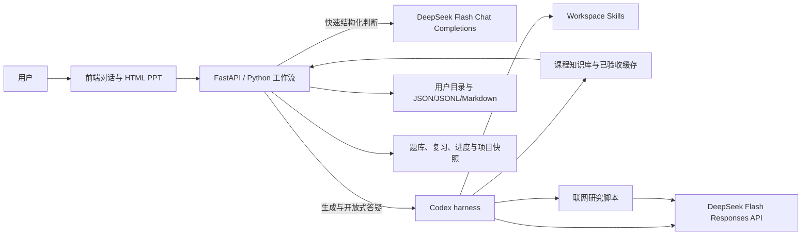

# Learning Agent 年度成本与完整执行工作流

> 文档日期：2026-08-24  
> 适用版本：当前 `main` 工作区  
> 目的：说明一年需要多少钱，以及从用户输入到 Plan、HTML PPT、练习、复习和知识沉淀时，前端、Python、Codex、Skills、DeepSeek 与知识库分别做什么。

## 1. 先给结论

### 1.1 一个重度用户一年多少钱

这里把“用户不停地学和问”定义为：**全年 365 天，每天约 200 万输入 Token、40 万输出 Token**。这大致相当于每天生成一份较完整的课程内容，再进行大量追问、修改讲义或追加练习。真实费用仍取决于上下文长度、回答长度和缓存命中率。

| 口径 | DeepSeek Flash API / 年 | 阿里云单用户独享部署 / 年 | 合计 / 年 |
| --- | ---: | ---: | ---: |
| DeepSeek 当前官网价 | 约 ¥1,022 | 约 ¥1,600–3,500 | **约 ¥2,622–4,522** |
| 按你提供的 Flash 空闲时段价 | 约 ¥1,752 | 约 ¥1,600–3,500 | **约 ¥3,352–5,252** |
| 按你提供的 Flash 高峰价，保守预算 | 约 ¥3,504 | 约 ¥1,600–3,500 | **约 ¥5,104–7,004** |

因此，如果只是你自己使用，建议先按 **每年 6,000 元左右**准备最保守的预算；按 DeepSeek 当前官网实际价格运行，最终更可能落在 **每年 3,000–4,500 元**。服务器若与多名用户共享，服务器摊到每人的成本会显著降低。

极端压力情形是每天约 500 万输入、100 万输出 Token：按你提供的 Flash 高峰价，API 约 ¥8,760/年；加独享服务器后约 ¥10,360–12,260/年。它不应作为普通学生的默认额度，而应作为防滥用和限额设计的压力边界。

### 1.2 当前项目实际使用哪个模型

当前项目默认使用 `deepseek-v4-flash`：

- Onboarding 意图识别：直接调用 Flash，关闭思考模式，输出结构化 JSON；
- Plan、诊断、HTML PPT、对话答疑、追加练习：由 Codex harness 调用 Flash；
- 选择题判分、翻页、进度、题库状态、Anki 间隔：Python 本地处理，不调用模型。

DeepSeek 当前官方文档说明，Responses API 和 Codex 集成目前只支持 `deepseek-v4-flash`，所以本文不把 Pro 当作当前生产默认模型。[DeepSeek Codex 集成说明](https://api-docs.deepseek.com/quick_start/agent_integrations/codex/)

## 2. 价格口径与计算方法

### 2.1 两套价格为什么不同

你提供的是分空闲和高峰时段的价格。为了避免低估，本文件保留它作为**保守预算口径**：

| Flash 单价，元 / 百万 Token | 空闲时段 | 高峰时段 |
| --- | ---: | ---: |
| 输入，缓存命中 | 0.05 | 0.10 |
| 输入，缓存未命中 | 1.50 | 3.00 |
| 输出 | 4.50 | 9.00 |

截至 2026-08-24，DeepSeek 当前官网显示的 Flash 价格是：缓存命中输入 ¥0.02/百万 Token、未命中输入 ¥1/百万 Token、输出 ¥2/百万 Token。官网同时明确价格可能调整，应以实际账单为准。[DeepSeek 模型与价格](https://api-docs.deepseek.com/zh-cn/quick_start/pricing/)

因此：

- 做财务预算时，用你提供的高峰价；
- 看当前真实消耗时，用 DeepSeek 控制台账单；
- 产品定价不能永久写死某一版模型单价，应保留成本倍率和额度开关。

### 2.2 公式

```text
年度 API 成本
= 未缓存输入百万 Token × 未缓存输入单价
+ 缓存输入百万 Token × 缓存命中单价
+ 输出百万 Token × 输出单价
```

本文主表先按“全部输入未命中缓存”计算，这是更保守的上限。若 30% 输入能命中缓存，重度用户按你提供的高峰价会从 ¥3,504 降到约 ¥2,868.90。

### 2.3 不同使用强度

| 用户强度 | 假设 | 年输入 | 年输出 | 当前官网 Flash | 你提供的 Flash 空闲价 | 你提供的 Flash 高峰价 |
| --- | --- | ---: | ---: | ---: | ---: | ---: |
| 轻度体验 | 180 天；每天 10 万输入、2 万输出 | 18M | 3.6M | ¥25.20 | ¥43.20 | ¥86.40 |
| 本科生常用 | 300 天；每天 50 万输入、10 万输出 | 150M | 30M | ¥210 | ¥360 | ¥720 |
| 重度学习 | 365 天；每天 200 万输入、40 万输出 | 730M | 146M | ¥1,022 | ¥1,752 | ¥3,504 |
| 极端压力 | 365 天；每天 500 万输入、100 万输出 | 1,825M | 365M | ¥2,555 | ¥4,380 | ¥8,760 |

“本科生常用”按当前官网价只有约 ¥17.50/月 API；按保守高峰价是约 ¥60/月。“重度学习”分别约为 ¥85.17/月和 ¥292/月。

### 2.4 如果未来切换 Pro

按当前官网价，Pro 的未缓存输入和输出单价约为 Flash 的 3 倍；按你提供的高峰价也是约 3 倍。相同重度用量大约是：

- 当前官网 Pro：约 ¥3,066/年；
- 你提供的 Pro 高峰价：约 ¥10,512/年。

当前 Codex 主链路仍应使用 Flash。将来 Pro 支持稳定后，也不建议所有请求全量切换；更合理的是只让毕业项目评审、复杂系统设计、困难课件修订等少量任务使用 Pro。

## 3. 阿里云部署成本

### 3.1 当前架构需要什么

当前服务不是在阿里云本地运行大模型，阿里云主要承担：

- FastAPI 服务；
- 静态前端；
- Codex 子进程与 Skills；
- 用户目录、Plan、课件、题库、记忆和项目文件；
- 日志、备份与出网流量。

DeepSeek 推理仍由 DeepSeek API 完成，所以不需要购买 GPU 服务器。

### 3.2 规划预算

以下是工程规划区间，不是阿里云正式报价。ECS 的实例、云盘、镜像、快照和公网带宽分别计费，地域和购买时长也会改变价格；最终应在购买页或价格查询接口确认。[阿里云 ECS 计费概览](https://help.aliyun.com/en/ecs/billing-overview) [ECS 最新价格查询接口](https://help.aliyun.com/en/ecs/developer-reference/api-ecs-2014-05-26-describeprice)

| 阶段 | 建议部署 | 年度基础设施预算 | 说明 |
| --- | --- | ---: | --- |
| 自己使用 / 内测 | 1 台 2 核 4G，40–80GB 云盘，3–5Mbps | ¥1,600–3,500 | 不上 RDS；定时备份用户目录即可 |
| 约 100 名月活 | 1 台 4 核 8G，或 2 台 2 核 4G；OSS 备份 | ¥4,000–10,000 | 需要限制并行 Codex 子进程，避免内存被瞬时打满 |
| 约 1,000 名月活 | 2–4 台 4 核 8G、负载均衡、对象存储与监控 | ¥20,000–60,000 | 当前本地文件存储要先改造成共享状态或按用户分片 |

阿里云 OSS 标准本地冗余存储的官方示例价是 ¥0.12/GB/月；50GB 单算容量约 ¥72/年，另有请求和公网下行等费用。[阿里云 OSS 存储费用](https://help.aliyun.com/zh/oss/storage-fees)

公网流量、快照、独立云盘或 EIP 可能在包年实例之外继续按量计费，不能只看 ECS 首页的实例价格。[阿里云账单说明](https://help.aliyun.com/en/user-center/bill-view)

### 3.3 规模化后的总账

假设每名活跃用户都属于“本科生常用”强度：

| 规模 | 当前官网 Flash API | 保守高峰价 API | 阿里云规划预算 | 总成本区间 |
| --- | ---: | ---: | ---: | ---: |
| 1 名重度独享用户 | ¥1,022 | ¥3,504 | ¥1,600–3,500 | 官网口径 ¥2,622–4,522；保守口径 ¥5,104–7,004 |
| 100 名活跃用户 | ¥21,000 | ¥72,000 | ¥4,000–10,000 | 官网口径 ¥25,000–31,000；保守口径 ¥76,000–82,000 |
| 1,000 名活跃用户 | ¥210,000 | ¥720,000 | ¥20,000–60,000 | 官网口径 ¥230,000–270,000；保守口径 ¥740,000–780,000 |

这说明平台成本的核心不是 OSS，而是模型用量。产品如果收费简单，最稳妥的两种方式是：

1. 用户自带 DeepSeek API Key，产品只收云同步或托管费；
2. 平台提供 API，但套餐包含年度 Token 额度，超额后降速、停止生成或改为用户自带 Key。

## 4. 之前有没有工作流文档

有，项目已经有两份：

- `product/PRD.md`：描述产品目标、功能和验收；
- `product/WORKFLOWS.md`：描述概念速学、从零到工程师、项目学习、精进、面试、题库和复习等用户路径。

本文件不替代它们，而是补上此前缺少的两层：

- **成本层**：每种模型调用如何产生 Token 和服务器成本；
- **执行层**：同一步到底由前端、Python、Codex harness、Skill、脚本还是知识库负责。

## 5. 真实系统架构



### 5.1 六个角色的边界

| 组件 | 负责什么 | 不负责什么 |
| --- | --- | --- |
| 前端 | 展示对话、选择题、Plan、PPT、进度、题库和等待状态；收集点击与自由输入 | 不保存权威学习状态，不直接持有 API Key |
| Python / FastAPI | 流程门禁、数据校验、确定性判分、状态推进、路径安全、事务回滚、缓存读取 | 不自己编造课程内容，不替代教师策略 |
| Codex harness | 在工作区内自主读取 Skills、知识库和用户上下文，调用工具，生成 Plan、课程和回答 | 不直接决定哪些模型输出可以不经校验落盘 |
| Skills | 规定教学方法、追问顺序、页面结构、出题原则、研究要求和边界 | 不承担持久化、并发、回滚和文件安全 |
| Scripts | 搜索、校验、状态提交、复习调度等可重复工具动作 | 不负责开放式教学判断 |
| 知识库 | 提供可复用的知识原子、路线、已验收章节和题目资产 | 不保存个人隐私、用户画像和私人答题记录 |

这是一套“Agent 决策 + 确定性工作流”的混合架构。它仍然是 Agentic AI：Codex 会根据当前任务选择并读取 Skill、知识与工具；Python 的作用是保证答对就是答对、文件不会串用户、失败能回滚，而不是替模型讲课。

## 6. 什么情况下会调用模型

### 6.1 一定会调用 DeepSeek 的动作

| 动作 | 调用方式 | 主要规则来源 | 典型调用次数 |
| --- | --- | --- | ---: |
| 首次意图识别与 slot filling | 直接 Flash，非思考，JSON | `learning-intent-router` | 正常 1 次；结构/语义错误最多修复 2 次 |
| 有基础或熟练者的个性化诊断题 | Codex harness | `adaptive-onboarding` | 1 次 |
| 生成个性化 Plan | Codex harness | `learning-plan`、必要时 `new-topic-research` | 1 次；用户修改一次再调用 1 次 |
| 新主题联网研究 | Codex + `web_search.py` + DeepSeek web search | `new-topic-research` | 缓存缺失或过期时调用 |
| 生成当前完整章节 HTML PPT | Codex harness | `adaptive-lesson-flow`、`progressive-code-teaching`、`quiz-designer` 等 | 每章通常 1 次；坏结构可能修复 1 次 |
| 自由问答、报错、代码讨论 | Codex harness，SSE 流式 | 由当前上下文自动选择相关 Skill | 每次用户主动发送算 1 轮 |
| 重做或修订讲义 | Codex harness | `lesson-revision` | 每次确认修改 1 次 |
| 追加针对性练习 | Codex harness | `practice-drill`、`quiz-designer` | 正常 1 次；坏结构可能修复 1 次 |
| 开放式文字证据评价 | Codex harness | 作业与完成评价规则 | 只在课程明确要求文字证据时调用 |

### 6.2 不调用模型的动作

- 打开网页、读取已有学习项目；
- 展示已经生成的 Plan 或课件；
- HTML PPT 翻页、进度条和侧栏定位；
- 课堂选择题的确定性判分；
- 把题目登记到题库；
- “没想起来 / 困难 / 顺利”的 Anki 评分和下次日期；
- 切换、归档、删除学习项目；
- 保存 JSON、JSONL、Markdown 和个人笔记；
- 命中同主题、同路线、同水平的已验收章节缓存；
- 打开真实练习文件夹。

这些本地动作不会因为用户点击得多就增加 DeepSeek Token。

## 7. 端到端完整工作流

### 7.1 打开页面与恢复项目

1. 前端读取 `user_id`，请求当前学习状态和项目列表。
2. Python 从 `userdir/u_<user_id>/` 读取权威数据。
3. 有旧项目时显示在左侧，用户点击即可继续，不重新 onboarding。
4. 没有活动项目时只显示对话输入，等待用户自由输入目标。
5. 这一阶段不调用大模型。

### 7.2 自由输入、意图识别和 slot filling

1. 用户可以输入“从零学 Go”“两天看懂 LangGraph 项目”“准备 AI 前端面试”等任意表达。
2. Python 把当前消息、最近对话、已经确认的槽位和 `learning-intent-router/SKILL.md` 发送给 Flash。
3. 模型只返回结构化决策：主题、目标、基础证据、路线、技术栈、是否还需追问等。
4. Python 校验证据必须来自用户原话，禁止模型擅自换主题或猜水平。
5. 只有缺失信息会改变 Plan 时，前端才在输入框上方显示 2–4 个动态选项；用户仍可直接打字。
6. 每轮结果覆盖 `onboarding/intent-state.json`，同时追加到 `onboarding/intent-events.jsonl`。

面试路线额外补齐：基础证据、目标岗位、技术栈、是否有真实面试题。用户有题时先入个人 Interview Bank；没有题时才在后续研究公开能力维度。

### 7.3 诊断

- 零基础：不反复考试，直接进入 Plan；
- 有一点基础：生成 3–4 道岗位或主题专属点击题；
- 熟练者：使用边界、故障、架构或迁移场景题；
- 题目由 Codex 生成，选项点击和得分由 Python 本地完成；
- 诊断证据决定 Plan 中哪些内容快进、哪些内容补强。

### 7.4 生成与确认 Plan

1. Python 先写入已确认画像和一个可恢复的活动项目状态。
2. Codex 读取 `learning-plan` Skill、画像、诊断、已有知识资产和研究结果。
3. 如果是新库、新 API、版本敏感主题、完整掌握或高级路线，先按 `new-topic-research` 搜索权威资料并生成 `sources.json`。
4. Codex 生成完整 `plan.md`；Python 校验主题、路线、章节结构、知识点和最终成果。
5. 前端在对话区按 Markdown 渲染 Plan，用户确认后才开课。
6. 用户直接在聊天框说“基础压缩一点”“加一个完整项目”，触发 `plan-revision`，保留已完成进度。

### 7.5 生成章节 HTML PPT

1. Python 先检查用户已有课件，再检查共享知识库中是否有同主题、同路线、同水平、且通过当前结构合同的已验收缓存。
2. 缓存可用：直接复制到用户课程，不调用模型。
3. 缓存不可用：Codex 读取 `adaptive-lesson-flow`，并按内容选择环境搭建、渐进代码、可视化、出题等 Skills。
4. Codex 一次生成当前章剩余全部知识点，而不是学一页就再生成一次。
5. Python 校验页面、答案、知识范围、中文注释、课后作业和路径，再原子保存。
6. 零基础且要运行代码时，第一章必须先包含软件安装、版本检查、目录和运行命令。

### 7.6 课堂学习

1. 用户逐页阅读 HTML PPT。
2. 代码在代码框中高亮，复杂关系使用 Mermaid；每页写明“本页请做”。
3. 课堂练习以可点击选择题为主，不要求反复在聊天框输入长答案。
4. Python 用私有答案表确定性判分，答错给最小提示，答对继续。
5. 翻页和判分不调用模型。

### 7.7 课后练习

1. 章节最后一页给独立练习、真实项目路径、运行命令和最多三条提示。
2. 用户在 Cursor、Trae 或其他编辑器亲手完成。
3. 课后练习不阻塞下一章，也不要求专用输出检测框。
4. 用户愿意提交时，把代码、运行结果或报错发到右侧聊天框，由 Codex 批改或答疑。

### 7.8 右侧聊天框的作用

聊天框是整套产品的自由交互入口，负责：

- 输入新的学习目标；
- 回答 onboarding 中无法被选项覆盖的真实需求；
- 讨论和修改 Plan；
- 学习中随时提问“为什么”“换个例子”“这行代码是什么意思”；
- 粘贴报错、代码、运行结果或课后作业；
- 要求重做当前 PPT；
- 要求“针对这个知识点再出三道题”；
- 追加新收集的面试题；
- 在课程结束后继续讨论或开始新项目。

聊天框不承担翻页、选择题判分和 Anki 按钮等确定性操作。成功的流式对话会写入 `memory/conversation-events.jsonl`；与当前课有关的问题和总结还会进入个人课堂笔记。

### 7.9 追加练习与修改课件

- 用户说“再出几道题”时，Codex 读取 `practice-drill` 和 `quiz-designer`；
- Python 校验题目、选项、答案、去重和隐私字段；
- 有活动讲义时，把题目追加到当前 PPT 总结前，并登记统一题库；
- 用户说“讲得太浅、图太少、代码一下子太长”时，Codex 读取 `lesson-revision` 重新生成；
- 新版本校验成功后才替换旧课件，失败保留旧版本。

### 7.10 章节推进、题库与复习

1. 必答课堂选择题通过后，Python 推进到下一章。
2. 课堂题、追加题、作业、面试题和重点问题进入统一题库。
3. 复习时先由 Python 选择到期和高优先级题，不调用模型。
4. 用户查看答案后选择“没想起来 / 困难 / 顺利”，Python 计算下一次复习日期。
5. 只有错题需要换一种方式讲解，或用户进行开放式作答时，才调用 Codex。

### 7.11 个人记忆、知识库和项目归档

个人目录保存：

```text
userdir/u_<user_id>/
├── profile.json
├── profile.md
├── learning-state.json
├── onboarding/
│   ├── intent-state.json
│   └── intent-events.jsonl
├── plans/
├── lessons/
├── practice-bank/
├── reviews/
├── interview-bank/
├── memory/
│   └── conversation-events.jsonl
├── projects/
└── .codex-runtime/
```

个人画像、纠正历史、对话、题目、错题和练习项目不进入公共知识库。

当一个章节完成课堂验证后，可把不含个人隐私的讲义、答案和知识原子保存到 `workspace/dev/curriculum/generated/`。以后只有主题、路线、水平和结构合同匹配时才能直接复用，否则仍按 Skills 重新生成。

## 8. 不同用户群体的完整路径

| 用户群体 | Onboarding | Plan 深度 | 课堂与练习 | 复习与最终验收 |
| --- | --- | --- | --- | --- |
| 只想了解一个概念 | 通常只确认是否还要看代码 | 1–3 个阶段 | 比喻、流程图、最小示例、1–2 道点击题 | 能说明作用和适用场景即可结束 |
| 零基础系统学习 | 确认最终成果与基础，不做冗长诊断 | 12–60 个动态阶段，含环境与毕业项目 | 小步代码、详细中文注释、课堂点击题、每章独立练习 | 间隔复习 + 大型毕业项目 |
| 有一点基础 | 3–4 道专属诊断 | 快进已证实内容，补齐缺口 | 迁移题和真实任务，薄弱处恢复小步教学 | 以新场景迁移证明掌握 |
| 熟练者精进 | 确认架构、性能、可靠性或工程目标 | 大项目贯穿，减少基础课 | 设计评审、故障演练、基准与重构 | 设计、实现、指标、测试和复盘 |
| 紧急看懂项目 | 读取项目和当前任务 | 入口、调用链、数据流和必要先修 | 代码阅读、输出预测、目标位置小修改 | 能解释请求链并独立修改 |
| 以项目为目标学习 | 确认交付物与技术约束 | 从验收倒推里程碑 | 在真实项目目录逐步实现 | 功能、测试、说明与复盘 |
| 面试且有真题 | 确认岗位、基础、技术栈，先收题 | 以个人真题按能力域重排 | 简答、追问、代码阅读和场景题 | Anki 回忆 + 实战题 + 模拟面试 |
| 面试但没有真题 | 确认岗位、基础和技术栈 | 搜索岗位能力与权威技术资料后规划 | 每章 2–4 道带答案和追问的表达题 | 完整岗位覆盖与模拟面试 |
| 回归复习用户 | 直接点击左侧旧项目 | 保留原 Plan 和进度 | 先处理到期题和历史错误，再继续新章 | 按复习证据动态安排下一次 |

## 9. 成本控制应放在哪里

### 9.1 立即可用的控制策略

- Onboarding 继续用 Flash 非思考模式；
- 选择题和 Anki 坚持 Python 本地判定；
- 同一章一次完整生成，避免按页重复请求；
- 优先读取已验收课件缓存；
- 对话只携带相关历史，不无限拼接全部聊天；
- 默认限制课件修订和追加练习的并发请求；
- 长路线分章生成，不一次输出整学期所有 PPT；
- 给每个用户设置日、月 Token 软额度和硬额度。

### 9.2 当前还缺的精确成本能力

当前代码已经记录业务事件，但还没有完整持久化每次 DeepSeek 响应的：

- 输入 Token；
- 缓存命中 Token；
- 输出 Token；
- 模型名；
- 功能类型；
- 用户和项目；
- 本次人民币成本。

因此本文是容量模型，不是实际账单。上线前应增加 `usage-events.jsonl` 或数据库表，以 `user_id + project_id + operation + model` 统计真实成本，再用 2–4 周内测数据修正套餐。

建议事件结构：

```json
{
  "user_id": "yang",
  "project_id": "go-foundation",
  "operation": "lesson_generation",
  "model": "deepseek-v4-flash",
  "input_tokens": 120000,
  "cached_input_tokens": 30000,
  "output_tokens": 18000,
  "cost_cny": 0.156,
  "created_at": "2026-08-24T12:00:00Z"
}
```

## 10. 最终判断

Learning Agent 的成本结构可以概括为：

```text
固定成本 = 阿里云 ECS + 云盘/OSS + 带宽/备份
可变成本 = Plan + 章节课件 + 自由问答 + 课件修订 + 追加练习的 DeepSeek Token
接近零的操作成本 = 翻页 + 点击判分 + 进度 + 题库 + Anki 调度 + 缓存复用
```

如果产品坚持简单付费和开源初心，最本质、最稳定的模式是：**开源本地版 + 用户自带 DeepSeek Key；付费提供云同步、托管备份、多设备恢复和免配置托管版**。如果平台替用户支付模型费用，就必须带年度额度，否则重度用户的 Token 成本会轻易超过低价年费。
