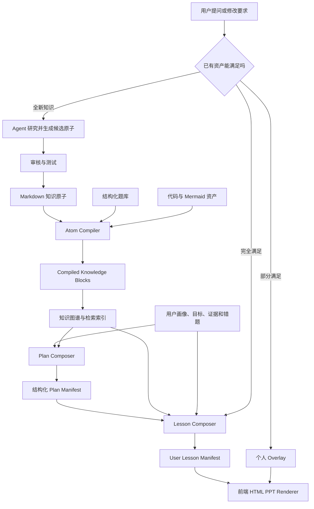

# Learning Agent 知识库、个性化课件与降本架构设计

> 状态：设计草案，等待产品确认  
> 日期：2026-08-24  
> 目标：采用“方案 B：知识原子 + 自动编译 + 动态组合 + 用户 Overlay”，在保持个性化教学的同时，大幅减少 Plan、HTML PPT、练习和答疑的模型调用与 Token 消耗。  
> 关联文档：[产品需求文档](PRD.md) · [完整工作流](WORKFLOWS.md) · [年度成本与执行工作流](COST_AND_EXECUTION_WORKFLOW.md)

## 1. 核心结论

Learning Agent 不应该把知识库当成“每次交给模型参考，然后重新写一份 PPT”的资料仓库。

知识库应该成为前端能够直接渲染的**教学组件库**：

```text
共享知识库提供：教什么
Skills 提供：怎么教
Python 提供：如何稳定组合、判分、推进和保存
Agent 提供：选择、调整和处理真正个性化的差异
前端提供：把组合结果渲染成可交互 HTML PPT
```

用户看到的课程仍然因人而异，但差异主要来自：

- 学哪些知识原子；
- 按什么顺序学习；
- 每个知识点讲多少；
- 使用零基础、普通还是进阶讲解；
- 是否需要逐行代码、图解或类比；
- 插入哪些课堂题、错题和课后练习；
- 是否结合用户正在学习的真实项目；
- 用户的个人问题、笔记、误区和补充页；
- 复习和下一章如何根据证据调整。

这意味着：

> **独一无二的学习体验，不等于每一个字都由模型重新生成。**

成熟知识库覆盖下，课件生成这一项预计可减少 **90%–99% Token**；把自由答疑、私人项目分析等不可复用部分也计算在内，整个产品的模型 Token 更现实地可以减少 **60%–90%**。具体比例取决于知识库覆盖率、题库丰富度和用户私人问题的占比。

## 2. 当前已经实现了什么

### 2.1 知识库结构

当前 `workspace/dev/curriculum/` 已经包含：

- Go 概念图；
- Python 概念图；
- 跨语言共享概念图；
- Go 和 Python 基础学习路线；
- 9 个 Go Markdown 知识原子；
- 5 个 Python Markdown 知识原子；
- 由实际课程完成后沉淀的 `generated/` 章节资产；
- 待整理的重要问题队列。

现有原子已经具有：

- 稳定原子 ID；
- 所属概念；
- 前置知识；
- 核心讲解；
- 最小示例；
- 交互演示规格；
- 练习；
- 常见误区；
- 版本和提取记录。

这说明项目已经开始按“知识原子”建设，并不是完全从零开始。

### 2.2 整章课件缓存

当前 `backend/knowledge_library.py` 会在学习者完成章节课堂验证后保存：

```text
<route>--<level>.lesson.json
<route>--<level>.answers.json
<route>--<level>.md
<route>--<level>.deck.html
```

下一名用户在以下条件完全一致时，可以直接复用：

- 学习主题一致；
- 路线一致；
- 能力层级一致；
- 当前章节一致；
- 待讲知识点列表一致；
- 缓存仍符合当前 Lesson Schema。

完全命中时不需要重新生成章节，已经能节省 Token 和等待时间。

### 2.3 当前 Lesson Manifest

当前 `LessonManifest` 已支持：

- 3–24 页课件；
- 讲解、示例、检查、练习和掌握页；
- Markdown；
- 代码及语言；
- 可点击选择题；
- 课后练习路径；
- 面试表达题；
- 进度、预计时间和完成方式；
- 私有答案表与公开讲义分离。

但是每一页现在保存的是完整 `markdown`、`code`、`question` 和 `options`，而不是对知识库教学块的引用。

### 2.4 当前 Plan

当前流程是：

```text
用户画像 + 诊断 + 知识来源
→ Codex 读取 learning-plan Skill
→ 必要时联网研究
→ 模型生成完整 Markdown Plan
→ Python 解析成 Curriculum
→ 用户确认
```

优点是自由度高，能够支持陌生领域和复杂目标。

问题是：

- 相同目标也会重复生成；
- Plan 较长时等待明显；
- 模型可能遗漏阶段、验收或前置依赖；
- 失败后需要重试；
- 知识图谱已经存在，但还没有充分用于确定性组装 Plan。

### 2.5 当前题库、复习和记忆

当前已经具备：

- 课堂选择题入库；
- 追加题入库；
- 面试题入库；
- 错题次数和掌握状态；
- Anki 式复习评分；
- Python 本地判分；
- 用户画像和意图事件；
- 对话 JSONL；
- 学习项目快照和切换。

这些部分本身已经非常适合零 Token 运行，是方案 B 的重要基础。

## 3. 当前方案还不等于完整的方案 B

现在可以称为：

> **知识原子雏形 + 整章课件缓存 1.0**

而完整方案 B 是：

> **知识原子组件化 + 自动编译 + 动态课件组合 + 用户 Overlay 2.0**

当前主要差距如下：

| 维度 | 当前实现 | 方案 B 目标 |
| --- | --- | --- |
| 复用单位 | 整章 | 单个知识原子、讲解块、代码块、图、题目 |
| Markdown 与 HTML | 两份资产，需要保持同步 | Markdown 是事实源，HTML 自动渲染 |
| Lesson 页面 | 保存完整内容副本 | 优先引用共享教学块 |
| 个性化 | 重新生成整章 | 组合共享块，只生成个人差异 |
| Plan | 每个用户由模型完整生成 | 知识图谱确定性组合，模型处理例外 |
| 练习 | 一部分随课件生成 | 优先从结构化题库选择，不足才生成 |
| 知识更新 | 整章缓存失效 | 原子级版本和依赖失效 |
| 聊天答疑 | 多数进入 Codex | 先判断状态、知识库直答、局部适配、复杂 Agent 四层 |
| 成本统计 | 业务状态为主 | 记录每次模型 Token、命中率与节省量 |

## 4. 三种方案对比

### 4.1 方案 A：整章缓存

适合当前 MVP，完全命中时零生成成本。

不足是命中条件过严。同一知识点只要路线、水平、章节范围或讲解需求变化，就容易重新生成完整课件。

### 4.2 方案 B：知识原子动态组合，最终选择

将知识点拆成可直接渲染的教学块，由 Lesson Composer 根据用户画像组合。

优点：

- 大部分页面无需模型生成；
- 不同用户仍能看到不同课程；
- 知识更新只影响相关教学块；
- 题库、代码和图可以独立维护；
- 生成失败率和等待时间显著降低；
- 适合 GitHub PR 共创；
- 适合云端低价学生套餐。

代价：

- 需要定义严格的知识原子 Schema；
- 需要编译器、Composer、版本系统和渲染器；
- 初期要把现有课件拆成可复用块；
- 需要建立内容质量审核流程。

### 4.3 方案 C：RAG 后每人重新生成

虽然个性化最自由，但每次仍要支付大段输入和输出 Token，且结构稳定性差。不适合作为主流程，只保留给真正独特的补充解释、私人项目和开放问题。

## 5. 方案 B 总体架构



## 6. 知识库的分层设计

### 6.1 第一层：概念图

概念图描述能力关系，不承载完整讲解。

```json
{
  "id": "go.functions",
  "title": "函数",
  "prerequisites": ["go.control-flow"],
  "outcomes": ["能够定义多返回值函数并解释参数传递"],
  "common_misconceptions": ["多返回值只是一个隐藏切片"]
}
```

用途：

- 决定 Plan 的先后顺序；
- 检查前置知识；
- 根据诊断跳过已掌握节点；
- 从目标能力反向计算最小必修子图；
- 避免模型随意发明课程顺序。

### 6.2 第二层：知识原子

一个知识原子是最小可复用教学单元。它不等于一整章，也不等于一个只有一句定义的知识点。

推荐 Front Matter：

```yaml
---
id: go.functions.multi-return
concept: go.functions
title: 函数与多返回值
version: 2
status: verified
prerequisites:
  - go.control-flow.if-switch
outcomes:
  - 能解释多返回值不是数组
  - 能正确处理 value 与 error
difficulty: beginner
estimated_minutes: 18
tags:
  - function
  - error-handling
sources:
  - id: go-spec-return-statements
    url: https://go.dev/ref/spec
content_language: zh-CN
---
```

推荐正文块：

```markdown
## 核心结论

所有用户都必须理解的稳定事实。

## 直觉解释

### variant: zero

零基础生活类比。

### variant: standard

普通讲解。

### variant: experienced

工程边界和语言对比。

## 图解

Mermaid 或其他结构化图。

## 最小示例

可独立运行的代码。

## 逐行讲解

关键行、数据变化和陌生 API。

## 边界案例

错误、性能、并发或工程边界。

## 常见误区

来自真实学习记录的误解。

## 课堂题引用

引用结构化题库 ID。

## 课后练习引用

引用练习资产 ID。

## 面试表达引用

引用面试题 ID。
```

### 6.3 第三层：代码、图和题目资产

代码不应长期只复制在 Markdown 中。需要真正运行和测试的代码应独立保存：

```text
curriculum/go/
├── atoms/
│   └── go.functions.multi-return.md
├── examples/
│   └── go.functions.multi-return/
│       ├── basic.go
│       └── error-case.go
├── diagrams/
│   └── go.functions.multi-return.mmd
├── questions/
│   └── go.functions.multi-return.jsonl
└── exercises/
    └── go.functions.multi-return/
        ├── beginner.md
        └── experienced.md
```

好处：

- 示例代码可以实际编译和测试；
- 题目可以独立统计正确率；
- Mermaid 图可以被多个课件复用；
- 修改代码不会复制到十几个 HTML；
- PR 可以只修改一个明确资产。

### 6.4 第四层：编译后的教学块

Markdown 适合人编辑，但运行时不应该每次临时解析完整仓库。

发布流程生成：

```text
workspace/releases/current/compiled-knowledge/
├── atoms/go.functions.multi-return.v2.json
├── indexes/by-concept.json
├── indexes/by-prerequisite.json
├── indexes/by-tag.json
├── indexes/by-route.json
└── content-hashes.json
```

一个编译块示例：

```json
{
  "block_id": "go.functions.multi-return:intuition:zero",
  "atom_id": "go.functions.multi-return",
  "atom_version": 2,
  "type": "explanation",
  "variant": "zero",
  "markdown": "把函数想成一台可以同时吐出结果和错误信息的机器……",
  "estimated_minutes": 3,
  "content_hash": "sha256:..."
}
```

前端或后端可以直接读取这些块，不需要把 Markdown 再交给模型改写。

## 7. 知识原子必须满足的质量合同

每个 `verified` 原子至少具备：

1. 稳定原子 ID；
2. 所属概念和前置依赖；
3. 一个不会因用户变化而变化的核心结论；
4. 零基础或普通讲解中的至少一个；
5. 可运行最小示例，代码有中文注释；
6. 至少一个常见误区；
7. 至少一道有私有答案的课堂题；
8. 至少一项课后练习或明确说明本原子不需要独立练习；
9. 版本敏感内容的权威来源；
10. 内容版本和变更记录。

完整掌握或工程路线常用原子还需要：

- 边界案例；
- 调试方法；
- 测试方式；
- 性能或安全注意事项；
- 工程代码引用；
- 迁移练习。

面试路线原子还需要：

- 30–90 秒参考回答；
- 回答结构；
- 常见遗漏；
- 追问链；
- 与岗位技术栈的关联。

## 8. 题库设计

题目不应全部嵌在课件文字里。推荐独立题目 Schema：

```json
{
  "id": "go.multi-return.choice.001",
  "atom_id": "go.functions.multi-return",
  "type": "choice",
  "difficulty": "beginner",
  "tests": ["concept", "misconception"],
  "prompt": "多返回值在调用方得到的是什么？",
  "options": [
    {"id": "a", "label": "一个隐藏数组"},
    {"id": "b", "label": "多个独立值"},
    {"id": "c", "label": "一个 map"}
  ],
  "correct_option_id": "b",
  "explanation": "多个返回位置分别产生独立值。",
  "misconception_id": "multi-return-is-array",
  "status": "verified",
  "version": 1
}
```

Composer 选题时考虑：

- 当前知识原子；
- 用户水平；
- 本章知识密度；
- 用户是否已经做过；
- 最近错题；
- 题目难度；
- 误区覆盖；
- 本月是否临近考试；
- 是否面试路线。

题库充足时，选题、判分、错题记录和 Anki 调度全程不调用模型。

## 9. Lesson Composer 设计

### 9.1 输入

```json
{
  "topic": "Go",
  "route": "foundation_engineer",
  "current_chapter_id": "chapter-3",
  "knowledge_point_ids": ["go.functions.multi-return"],
  "learner": {
    "level": "zero",
    "preferred_style": "visual",
    "session_minutes": 25,
    "mastered_atom_ids": [],
    "recent_misconceptions": ["multi-return-is-array"],
    "due_review_ids": []
  },
  "project_context": null
}
```

### 9.2 确定性组合规则

零基础用户：

```text
核心问题
→ 零基础直觉
→ 图解
→ 最小代码
→ 逐行讲解
→ 1–3 道课堂点击题
→ 一项课后练习
```

有一点基础：

```text
边界判断题
→ 暴露缺口
→ 只补缺失解释
→ 迁移代码
→ 1–2 道迁移题
→ 课后练习
```

熟练者：

```text
真实任务或故障案例
→ 工程边界
→ 设计取舍
→ 高难迁移题
→ 项目任务
```

面试用户：

```text
最小先修
→ 核心知识
→ 场景题
→ 口述回答结构
→ 常见追问
→ Anki 回忆卡
```

### 9.3 输出 User Lesson Manifest

```json
{
  "lesson_id": "go-functions-u-yang-001",
  "knowledge_release": "2026.08.24",
  "renderer_version": 2,
  "route": "foundation_engineer",
  "level": "zero",
  "pages": [
    {
      "id": "page-1",
      "content_ref": "go.functions.multi-return:core:v2"
    },
    {
      "id": "page-2",
      "content_ref": "go.functions.multi-return:intuition:zero:v2"
    },
    {
      "id": "page-3",
      "content_ref": "go.functions.multi-return:diagram:v2"
    },
    {
      "id": "page-4",
      "content_ref": "go.functions.multi-return:example:line-by-line:v2"
    },
    {
      "id": "page-5",
      "question_ref": "go.multi-return.choice.001:v1"
    }
  ],
  "overlays": [],
  "progress": {
    "current_page": 1,
    "total_pages": 5
  }
}
```

这个 Manifest 很小，可以由 Python 规则直接生成。只有目标非常特殊时才需要模型参与选择。

## 10. 用户个性化具体体现在哪里

### 10.1 学习内容的选择

不同用户可能学习同一主题，但最终目标不同：

- 只想理解概念；
- 看懂现有项目；
- 从零达到工程师；
- 为考试复习；
- 为面试准备；
- 从中级精进到高级。

Plan Composer 从完整知识图谱中选择不同子图，而不是让所有人走同一目录。

### 10.2 讲解数量

同一个原子可以有多种块：

| 用户状态 | 讲解策略 |
| --- | --- |
| 零基础 | 直觉、图、最小示例、逐行讲解、一个动作一页 |
| 有一点基础 | 快速判断，缺哪里补哪里 |
| 熟练 | 省略定义，直接进入边界、实现和取舍 |
| 最近连续答错 | 插入另一种解释、对比例子和针对性题 |
| 最近连续答对 | 减少解释页，提前进入迁移任务 |

个性化不是简单修改字体，而是控制教学披露的深度。

### 10.3 是否循序渐进

用户面对陌生框架或长代码时：

```text
先建立组件关系
→ 展示最小骨架
→ 一次增加一个陌生 API
→ 解释数据如何流动
→ 最后展示完整代码
```

熟练用户则可以直接查看完整边界案例，再按卡点展开相关原子。

### 10.4 题目个性化

题目根据以下数据选择：

- 当前知识点；
- 用户目标；
- 用户水平；
- 最近答错的误区；
- 已经做过的题；
- 复习到期情况；
- 是否需要考试或面试表达；
- 当前可用学习时间；
- 是否正在做真实项目。

例如同一个函数知识点：

- 零基础：识别函数参数和返回值；
- 中级：判断错误处理路径；
- 熟练：设计接口与错误边界；
- 面试：口述为什么使用 `(value, error)`；
- 项目用户：在自己的代码中找到错误未处理的位置。

### 10.5 项目上下文个性化

公共知识原子仍然提供稳定事实。Agent 只额外生成：

- 这个知识点在用户项目的哪个文件；
- 用户代码中的真实调用链；
- 与当前任务相关的改动建议；
- 针对该项目的练习；
- 用户提交代码的反馈。

这些内容保存为个人 Overlay，不污染公共原子。

### 10.6 笔记和补充页个性化

用户在聊天框提出的重要问题会成为：

- 当前课程的个人笔记；
- 个人易错点；
- 复习卡；
- 必要时插入 PPT 的个人解释页；
- 多用户重复出现后，进入公共知识库待整理队列。

### 10.7 节奏个性化

Composer 根据：

- 每次学习时长；
- 最近完成速度；
- 选择题正确率；
- 提示使用次数；
- 到期复习数量；
- 用户主动跳过或深入的选择；

决定一章包含多少原子、多少页面和多少练习。

## 11. 用户 Overlay 设计

Overlay 只保存不能共享的个人差异：

```json
{
  "overlay_id": "overlay-u-yang-001",
  "lesson_id": "go-functions-u-yang-001",
  "after_page_id": "page-4",
  "type": "personalized_explanation",
  "reason": "用户把多返回值误认为数组",
  "content": {
    "title": "它不是一个数组",
    "markdown": "你刚才把两个返回值理解成了一个集合……",
    "diagram": null,
    "code_ref": null
  },
  "source": "agent",
  "created_at": "2026-08-24T12:00:00Z"
}
```

Overlay 类型包括：

- 个人补充解释；
- 用户项目映射；
- 个人错题重讲；
- 临时图解；
- 个人练习；
- 用户笔记；
- 课程奖励；
- 老师或用户手工添加的页面。

当同一种 Overlay 在多个用户中反复出现，并且教学效果通过验证时，可以提炼成公共原子的新 Variant。

## 12. 用户要求修改 PPT 时的省 Token 路由

### 12.1 “讲简单一点”

优先动作：

```text
experienced variant
→ standard 或 zero variant
→ 增加图解和逐行代码
```

知识库已有对应 Variant 时零模型调用。

### 12.2 “讲快一点”

```text
移除可选类比页
→ 保留核心结论和边界
→ 减少低难度题
→ 提前进入迁移任务
```

由 Composer 修改 Manifest，不重新生成内容。

### 12.3 “再画一张流程图”

- 知识库有图：直接插入；
- 没有图：只生成一张个人 Mermaid Overlay；
- 图经过验证后，进入待整理队列。

### 12.4 “再出三道题”

- 题库有题：直接抽取；
- 题库不足：只生成缺少的题；
- 不重写前面讲义。

### 12.5 “用我的项目解释”

- 公共解释继续复用；
- Codex 只读取相关项目文件；
- 生成一到数张项目专属 Overlay；
- 不重写公共知识页。

## 13. HTML PPT 如何生成

### 13.1 Markdown 不再和 HTML 手工同步

目标流程：

```text
Markdown / JSON / Code / Mermaid
→ validate
→ compile
→ Lesson Manifest
→ 前端 Renderer
→ HTML PPT
```

HTML PPT 是运行时视图，不是第二份事实源。

### 13.2 前端 Renderer 负责

- Markdown 渲染；
- 代码高亮和复制反馈；
- Mermaid；
- 页面进度；
- 选择题交互；
- 本页行动提示；
- Overlay 合并；
- 用户笔记；
- 导出离线 HTML 或 PDF。

Renderer 更新配色或布局时，不需要重新生成知识内容。

### 13.3 离线 HTML

如果用户需要下载独立 HTML：

```text
Lesson Manifest
+ 固定版本教学块
+ 个人 Overlay
+ 当前 Renderer
→ 导出静态 HTML Snapshot
```

它是导出产物，不需要回写公共知识库。

## 14. 知识库更新与版本策略

### 14.1 原子版本

每个原子有独立版本：

```text
go.functions.multi-return@v2
```

内容哈希记录实际内容：

```text
atom_id + atom_version + block_variant + content_hash
```

### 14.2 用户课程固定版本

正在学习的 Lesson Manifest 固定引用版本，避免用户翻到一半内容突然变化。

知识库更新后：

- 新用户使用最新版本；
- 尚未开始的章节可以自动升级；
- 正在学习的章节继续使用原版本；
- 已完成章节和个人笔记保持不变；
- 严重事实修复显示明确更新提示。

### 14.3 依赖失效

原子修改后，只使以下内容失效：

- 直接引用该版本的编译块；
- 依赖该块的预组合课件缓存；
- 相关索引和导出 HTML。

不应该让整门课程所有章节全部失效。

### 14.4 Renderer 版本

样式、布局和交互由 `renderer_version` 管理。只改 UI 时无需提升知识原子版本。

## 15. Plan 的省 Token 方案

### 15.1 当前问题

当前每次 Plan 都需要：

- 注入用户画像；
- 注入 Skill；
- 注入研究结果；
- 让模型写完整 Markdown；
- 再解析成 Curriculum；
- 失败时重试。

这是等待时间长和结构失败的重要来源。

### 15.2 Plan Composer

将 Plan 分为“结构”和“说明文字”：

```text
结构：Python + 概念图 + 路线模板确定性生成
说明：可选的小模型润色
例外：真正陌生目标再让 Codex 研究和规划
```

### 15.3 路线模板

```text
concept_clarity
project_understanding
project_delivery
foundation_engineer
senior_engineer
interview_sprint
exam_review
```

每个模板规定：

- 最终成果；
- 必须出现的阶段类型；
- 是否需要环境准备；
- 是否需要毕业项目；
- 课堂、练习、复习的比例；
- 哪些证据可以跳过节点；
- 最终验收方式。

### 15.4 确定性 Plan 计算

```text
目标能力
→ 从概念图反向找到所需节点
→ 加入所有未掌握前置
→ 移除已有可靠掌握证据的节点
→ 按依赖拓扑排序
→ 按每次学习时长分章
→ 插入到期复习
→ 加入项目或考试里程碑
→ 生成 Plan Manifest
```

### 15.5 Plan Manifest

```json
{
  "topic": "Go",
  "route": "foundation_engineer",
  "target_outcome": "独立完成并测试一个 Go Web 服务",
  "knowledge_release": "2026.08.24",
  "stages": [
    {
      "id": "environment",
      "type": "environment_setup",
      "atom_ids": ["go.environment.toolchain"]
    },
    {
      "id": "functions",
      "type": "learning",
      "atom_ids": [
        "go.functions.basic",
        "go.functions.multi-return"
      ]
    }
  ],
  "graduation_project_ref": "go.projects.web-service.beginner"
}
```

前端再把它确定性渲染成 Markdown Plan。

### 15.6 什么时候仍调用模型生成 Plan

- 知识库没有该主题；
- 用户目标无法映射到现有路线；
- 用户提供陌生真实项目；
- 目标涉及版本敏感技术；
- 需要设计新的大型毕业项目；
- 用户提出跨多个领域的特殊组合；
- 确定性 Plan 通过不了覆盖检查。

即使调用模型，也只让模型补充“缺失子图或例外阶段”，不重写整个已有 Plan。

## 16. 聊天答疑的四层省 Token 路由

### 第 1 层：状态问题，零 Token

示例：

- “我下一步做什么？”
- “我学到哪了？”
- “有哪些错题？”
- “今天复习什么？”

Python 读取状态后直接回答。

### 第 2 层：知识库直接回答，零或极低 Token

示例：

- “多返回值是什么意思？”
- “这张图表示什么？”
- “这道题为什么选 B？”

直接返回原子中的对应讲解或题目解析。

### 第 3 层：局部个性化，小模型调用

示例：

- “我还是没懂，换个生活例子。”
- “用 Python 对比 Go 解释一下。”
- “再给我一个更简单的代码。”

只向模型提供：

- 当前原子；
- 用户水平；
- 当前误区；
- 这一个问题。

不提供整门课程和全部历史。

### 第 4 层：复杂 Agent 调用

示例：

- 分析用户项目；
- 调试真实错误；
- 修改架构；
- 评价开放式作业；
- 研究知识库没有的新技术。

这时才让 Codex 读取代码、Skills、知识库和工具。

## 17. Token 节省测算

### 17.1 计算公式

```text
节省比例
= 1 - 方案 B 实际 Token / 每个用户完整重新生成 Token
```

方案 B 实际 Token 包含：

- 基础知识资产首次生成和审核；
- 少量需要模型参与的个性化 Manifest；
- 用户专属 Overlay；
- 知识库没有的新内容；
- 真正开放式答疑。

### 17.2 单章课件示例

假设当前完整生成一章需要：

```text
输入 100,000 Token
输出 20,000 Token
合计 120,000 Token
```

方案 B 的几种情况：

| 情况 | 输入 | 输出 | 相比完整生成节省 |
| --- | ---: | ---: | ---: |
| 完全由知识库组合 | 0 | 0 | 100% |
| 只让小模型决定页面顺序 | 3,000 | 500 | 约 97.1% |
| 增加一个个人补充页 | 10,000 | 2,000 | 约 90% |
| 有一半内容需要重新生成 | 50,000 | 10,000 | 约 50% |

### 17.3 1,000 人学习 20 章

每人完整生成：

```text
1,000 人 × 20 章 × 120,000 Token
= 2,400,000,000 Token
```

方案 B 假设：

- 20 章公共基础内容各构建一次：240 万 Token；
- 1,000 份课程级个性化清单，每份 6,000 Token：600 万 Token；
- 20% 的用户章节需要一个 12,000 Token 的个人补充页：4,800 万 Token；

总计：

```text
2.4M + 6M + 48M = 56.4M Token
```

相比 2.4B：

```text
1 - 56.4M / 2.4B
= 97.65% 节省
```

这是课件生成部分的示例，不包含用户自由问答。

### 17.4 按知识库成熟度估算

| 知识库状态 | Plan + 课件生成节省 | 产品整体 Token 节省 |
| --- | ---: | ---: |
| 初期：原子覆盖 20%–30% | 30%–50% | 20%–40% |
| 成长期：本科核心课程覆盖 50%–70% | 60%–85% | 45%–70% |
| 成熟期：核心课原子、题库和 Variant 完善 | 90%–99% | 70%–90% |

产品整体无法保证 99%，因为用户的私人项目、开放作业和独特追问仍需要 Agent。

### 17.5 Plan Token 节省

假设当前完整 Plan 使用 80,000 输入和 10,000 输出，共 90,000 Token。

采用图谱组合：

- 完全命中路线模板：零模型 Token；
- 小模型只写用户可读摘要：约 5,000 输入和 1,000 输出；
- 只补一个特殊项目阶段：约 10,000–20,000 Token。

常见路线的 Plan 预计可以减少 **80%–100% Token**，并把等待时间从分钟级降低到秒级。

### 17.6 答疑 Token 节省

假设当前问答携带 30,000 Token 上下文，输出 2,000 Token。

局部检索后只携带 3,000 Token 原子，输出仍为 2,000 Token：

```text
当前：32,000 Token
方案 B：5,000 Token
节省：约 84.4%
```

如果知识库可以直接返回标准解释，则这一轮模型成本为零。

## 18. 知识检索不能怎么做

不能把整门课程 Markdown 每次全部塞给模型。

否则：

- 输入 Token 仍然很高；
- 模型容易被无关内容干扰；
- 上下文越长价格可能越高；
- 响应变慢；
- 难以定位知识版本。

推荐检索顺序：

```text
精确 atom_id
→ concept_id
→ prerequisite 和 route 过滤
→ 标签、难度和版本过滤
→ 必要时再用向量或语义搜索
```

结构化课程学习优先走图谱和 ID，不应默认依赖向量数据库。向量检索主要用于自由问答和用户表达不明确的情况。

## 19. 缓存设计

### 19.1 编译块缓存

键：

```text
atom_id + atom_version + block_type + variant + content_hash
```

### 19.2 组合课件缓存

键：

```text
knowledge_release
+ route
+ level
+ ordered_atom_ids
+ teaching_style
+ renderer_version
```

### 19.3 个性化 Manifest 缓存

用户目标、掌握证据和错题版本未变化时，重复打开不重新组合。

### 19.4 语义答疑缓存

只缓存经过验证的标准问题和答案。私人项目、隐私代码和用户特定结论不能进入公共缓存。

## 20. 知识库自生长

```text
用户学习新主题
→ 检索不到原子
→ Agent 搜索权威来源
→ 生成候选原子和题目
→ 结构、代码、答案和来源测试
→ 先作为用户课程使用
→ 学习效果通过验证
→ 进入 curation/pending
→ 人工或 PR 复核
→ verified 原子
→ 后续用户直接复用
```

不能因为模型生成成功就直接成为公共知识。

推荐状态：

```text
draft
candidate
verified
deprecated
```

## 21. 收费方案

### 21.1 两个版本足够

| 版本 | 价格 | 模型 | 数据 |
| --- | ---: | --- | --- |
| 本地开源版 | 免费 | 用户自己配置 DeepSeek 或其他兼容 API | 本地保存 |
| 云端学生版 | ¥30/月或¥199/年 | 使用平台提供的模型额度 | 云端保存，手机和电脑同步 |

不需要设计多层复杂会员。

### 21.2 云端学生版包含

- 免配置模型；
- 个性化 Plan；
- HTML PPT；
- AI 答疑；
- 讲义调整；
- 追加练习；
- 公共知识库课程；
- 题库和 Anki 复习；
- 用户画像和学习记忆；
- 手机与电脑同步；
- 云端备份。

### 21.3 额度展示

用户只看到：

```text
本月 AI 学习额度：已使用 68%
```

内部根据真实人民币成本累计，不向学生展示复杂 Token。

建议首版内部限制：每个账户每月模型成本预算约 ¥8–10。知识库命中、翻页、题库、选择题、复习和同步不计入模型额度。

### 21.4 超额后的行为

继续可用：

- 已有课程；
- HTML PPT；
- 题库和选择题；
- Anki 复习；
- Plan；
- 笔记；
- 手机同步；
- 学习进度。

暂停：

- 生成新 Plan；
- 生成新章节；
- AI 自由答疑；
- 重新生成课件；
- 生成新题。

用户可以等待下月恢复，也可以切换自己的 API Key。不要锁住已经付费获得和已经生成的学习内容。

### 21.5 为什么方案 B 支撑低价收费

如果每名用户都重新生成全部课程，¥199 年费容易被重度用户吃掉利润。

方案 B 成熟后：

- 公共基础课程几乎零边际生成成本；
- Plan 多数确定性生成；
- 题库和复习零模型成本；
- 只有个人补充页、自由答疑和私人项目产生可变成本；
- 重度用户仍受每月模型预算保护。

因此 ¥30/月或 ¥199/年才有机会长期成立。

### 21.6 手机同步范围

第一版同步：

- 学习项目；
- Plan Manifest；
- Lesson Manifest；
- 页面进度；
- 题库、错题和复习状态；
- 用户笔记和 Overlay；
- 对话摘要和重要记忆；
- 用户设置。

大型依赖目录不必第一版全部同步。代码项目可以先同步源码、作业和提交记录，忽略依赖、构建产物和缓存。

## 22. 兼容当前项目的迁移方案

### 阶段 0：先建立真实成本基线

- 记录每次模型调用的输入、缓存、输出、模型和成本；
- 记录 Plan、Lesson、问答、修订和练习的分类；
- 建立知识库命中率指标；
- 不改变当前用户体验。

### 阶段 1：Atom Compiler

- 扩充 Markdown 原子 Schema；
- 将 Markdown 编译成结构化 Blocks；
- 校验前置、代码、题目、答案、来源和版本；
- `.deck.html` 改为编译或导出产物；
- 保留当前完整 Lesson JSON 兼容旧用户。

### 阶段 2：Lesson Composer

- 为当前 `LessonPage` 增加 `content_ref`、`question_ref` 和 `content_hash`；
- 允许同一 Manifest 同时包含共享引用页和旧的内嵌页；
- 常见 Go/Python 章节优先通过 Blocks 组合；
- 知识缺口继续走现有 Codex 生成器；
- 用户专属内容进入 Overlay。

### 阶段 3：Plan Composer

- 将路线模板结构化；
- 从概念图计算最小必修子图；
- 根据诊断移除已掌握节点；
- 确定性生成 Curriculum；
- 前端从结构化 Plan 渲染 Markdown；
- 特殊目标才调用 Codex 补充。

### 阶段 4：题库与四层答疑

- 将题目从课件中拆为独立资产；
- 优先从题库选择；
- 加入状态直答、知识库直答、局部适配和完整 Agent 四层路由；
- 建立已验证 FAQ 缓存。

### 阶段 5：云端收费与同步

- 账号与项目同步；
- 服务器端 API Key；
- 月度人民币成本额度；
- 并发和每日防刷限制；
- 超额后只停止新的 AI 生成；
- 手机 PWA；
- 账单和用量监控。

## 23. 关键内部接口

建议内部能力边界：

```text
search_atoms(query, filters)
get_atom(atom_id, version)
compile_atom(atom_path)
compose_plan(profile, goal, evidence)
compose_lesson(plan, profile, evidence)
resolve_manifest(manifest)
select_questions(atom_ids, learner_state, count)
append_overlay(lesson_id, overlay)
invalidate_atom(atom_id, old_version)
record_usage(user_id, operation, tokens, cost)
```

这些可以先作为 Python 模块，不需要一开始全部暴露成网络 API。

## 24. 失败与回退策略

- 编译失败：保留上一版 verified 原子；
- 新原子校验失败：只保留在 candidate，不进入正式索引；
- Manifest 引用不存在：回退到最近可用版本或现有整章生成器；
- Overlay 生成失败：原课件保持不变；
- Plan Composer 找不到路线：回退 Codex 研究与规划；
- 知识库更新失败：不影响用户已固定版本课件；
- 云同步失败：本地保留未上传事件，恢复后继续；
- 模型额度耗尽：已有学习内容保持可用。

## 25. 测试设计

### 25.1 原子测试

- Front Matter 字段完整；
- 原子 ID 唯一；
- 前置依赖存在且无环；
- 代码能运行或明确标记伪代码；
- 中文注释符合教学要求；
- 题目答案属于选项；
- 来源 ID 存在；
- Variant 名称合法。

### 25.2 Composer 测试

- 零基础包含环境和渐进讲解；
- 熟练者不会重复基础定义；
- 面试路线包含表达题；
- 已掌握原子不会重新成为必修；
- 最近错题进入针对性练习；
- 页面数符合学习时间；
- 不生成重复题；
- 课后练习不阻塞下一章。

### 25.3 版本测试

- 修改一个原子只使依赖缓存失效；
- 活动课程保持固定版本；
- 新用户使用最新版；
- Renderer 更新不改变知识内容；
- 严重修复能够提示旧用户更新。

### 25.4 成本测试

- 知识库命中时没有模型调用；
- 题库足够时追加题不调用模型；
- 状态问题不调用模型；
- 局部答疑不会注入整门课程；
- 重试不会重复记账；
- 超额后不会启动新的模型任务。

## 26. 上线指标

| 指标 | 初期目标 | 成熟目标 |
| --- | ---: | ---: |
| 核心本科课程知识块命中率 | 40% | 80% 以上 |
| Plan 确定性生成比例 | 30% | 80% 以上 |
| 章节无模型组合比例 | 30% | 75% 以上 |
| 普通答疑零模型或局部模型比例 | 30% | 70% 以上 |
| Plan 首次可见时间 | 30 秒以内 | 5 秒以内 |
| 知识库命中课件首次可见时间 | 5 秒以内 | 2 秒以内 |
| 单个活跃用户月模型成本 | ¥10 以内 | ¥3–6 |
| 产品整体 Token 节省 | 30% 以上 | 70%–90% |

## 27. 不应在第一版做的事情

- 不先建设复杂向量数据库；
- 不把全部知识库塞给模型；
- 不同时维护 Markdown 和手写 HTML 两份事实源；
- 不为每种用户提前生成整套完整课件；
- 不开发很多会员套餐；
- 不出售无限 AI；
- 不先建设原生 iOS 和 Android App；
- 不在知识原子 Schema 稳定前批量迁移所有领域；
- 不让未经审核的用户私人内容自动进入公共知识库。

## 28. 推荐实施顺序

最优顺序是：

1. 模型用量与成本记录；
2. Markdown 原子 Schema 2.0；
3. Atom Compiler；
4. 前端基于 Manifest 渲染共享 Block；
5. 先改造一门 Go 入门课程作为试点；
6. Lesson Composer；
7. 用户 Overlay；
8. 结构化题库；
9. Plan Composer；
10. 四层答疑路由；
11. 扩充计算机本科知识库；
12. 云端同步、额度和收费。

不能先花几个月把所有知识内容写完，再开始验证架构。应该先用 Go 的 5–10 个知识原子验证：

- 能否自动编译；
- 能否组合出零基础和进阶两套不同课件；
- 能否插入用户 Overlay；
- 能否保持题库判分；
- 能否证明一次知识建设被多名用户复用；
- 能否真实降低 Token 和等待时间。

## 29. 最终决策

本设计选择方案 B：

> **Markdown 知识原子作为唯一教学事实源；通过编译生成结构化教学块；由 Plan Composer 和 Lesson Composer 根据用户目标、水平、证据和错题进行动态组合；前端渲染 HTML PPT；只有真正独特的解释、私人项目和新知识生成个人 Overlay 或候选原子。**

商业上采用：

> **免费本地开源版，自带 API；云端学生版 ¥30/月或 ¥199/年，包含平台模型额度、云同步和手机端；额度耗尽后停止新的 AI 生成，但已有学习内容继续使用。**

这套设计的核心价值不是把同一课程反复交给模型重写，而是把一次优秀教学沉淀为可以被组合、验证、升级和共同维护的公共资产。
