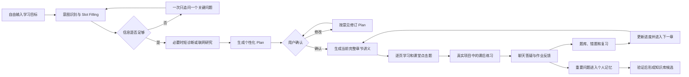
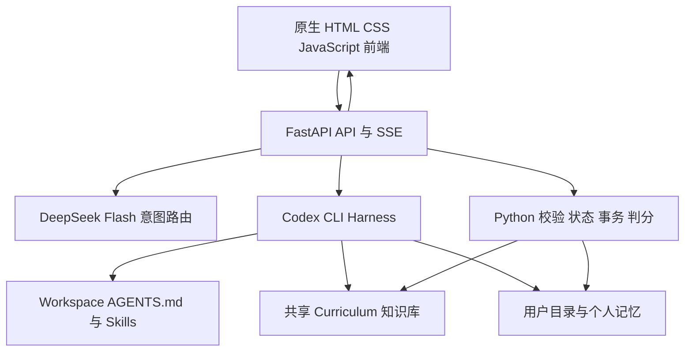
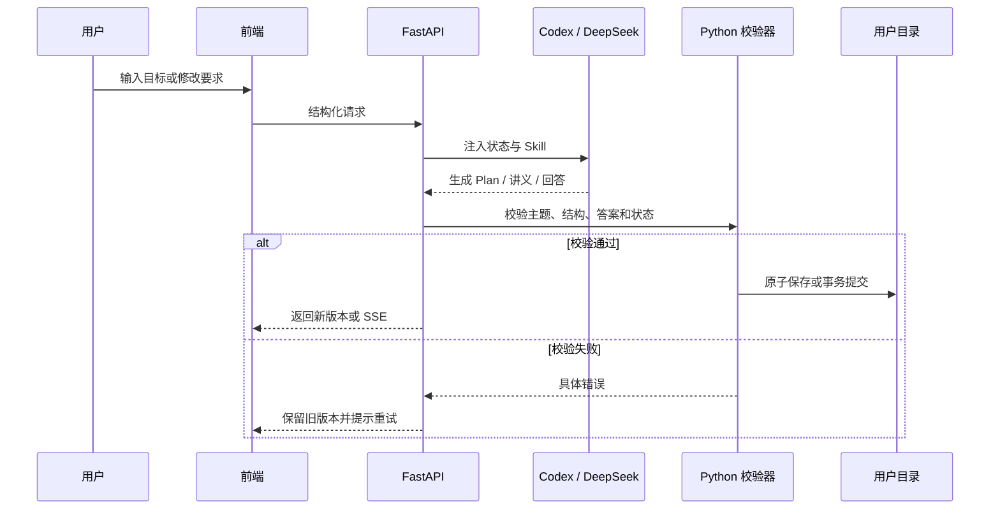

# Learning Agent 产品与系统总说明

> 本文是 Learning Agent 的统一说明文档。它以当前仓库代码为准，说明产品目的、用户画像、完整工作流、Codex Harness、Workspace Skills、Python 状态机、知识库、用户目录和前端交互。未来修改产品行为时，应先用本文判断应该改 Skill、Python、知识库还是前端。

## 0. 阅读说明

本文区分三类信息：

- **当前已实现**：当前代码已经提供，并有对应接口或文件。
- **规则层能力**：已经写进 Workspace Skill，但是否生效还取决于相应后端是否调用该 Skill。
- **后续目标**：产品方向正确，但当前还没有完整实现，不能对外宣传为现成功能。

本文删除并替代原来的 `LEARNING_AGENT_SYSTEM_GUIDE.html`。这里删除的是产品说明页，不是产品运行所需的前端 HTML，也不是教学用的 HTML PPT。

---

## 1. 项目基本信息

### 1.1 项目目的

Learning Agent 不是固定课程网站，也不是只会回答问题的聊天机器人。它要把学习者的一句自然语言目标，转化成一条可以确认、执行、练习、复习和持续调整的学习路线。

产品要解决五个核心问题：

1. **不知道从哪里开始**：用意图识别和少量关键问题理解真实目标。
2. **课程不适合自己**：按基础、目标、期限、技术栈和已有证据生成个性化 Plan。
3. **只看懂却不会做**：用逐页讲义、点击题、真实代码目录和课后练习形成闭环。
4. **学完容易忘**：把课堂题、错题、作业和面试题放进统一题库，用间隔复习再次出现。
5. **每次都重新生成太贵**：优先复用共享知识库、知识原子、研究资料和已验证课件，让模型主要处理真正的个性差异。

长期定位是：

> 一个以共享计算机知识库为内容底座，以 Codex Harness 为 Agent 运行时，以 Skills 为教学策略，以用户目录为个人学习记忆的自适应学习系统。

### 1.2 当前产品形态

当前界面分为两个阶段：

#### 初始阶段

- 左侧显示已有学习项目，用户可直接继续，不需要重新 onboarding。
- 主区域是一个自由输入对话框。
- 用户可以输入概念、课程、项目、面试目标、API 或具体问题。
- 系统只在缺少真正影响 Plan 的信息时追问。
- Plan 先作为 Markdown 对话消息展示，用户确认后才进入学习工作台。

#### 学习阶段

- 左侧：课程大纲、当前进度、练习题库。
- 中间：可翻页的 HTML PPT，包括 Markdown、代码高亮、Mermaid、选择题和课后练习。
- 右侧：持续答疑、修改讲义、追加练习、提交作业和记录个人问题的聊天框。

### 1.3 整个项目流程



---

## 2. 产品经理视角：用户画像

### 2.1 零基础学习者

**典型表达**：

- “我想从零学 Go。”
- “我完全不会编程，想学 Python。”
- “我想从零成为后端工程师。”

**核心困难**：不知道环境怎么装、看不懂长代码、容易在小知识点上反复卡住。

**产品策略**：

- 不做技术诊断，避免拿不会的东西考用户。
- Plan 从环境准备、最小程序和基本心智模型开始。
- 第一章讲义明确软件下载、官方地址、版本检查、课程项目目录和运行命令。
- 代码先展示 6–10 行骨架，每次只加入一个新概念，并写详细中文注释。
- 课堂只做少量点击题；课后在真实项目目录自己敲代码。
- 完整掌握路线最后以大型毕业项目验收。

### 2.2 有一点基础的学习者

**典型表达**：“学过一点 Java，但不扎实”“会写基础语法，项目做得少”。

**核心困难**：基础不连续，自己不知道缺口在哪里。

**产品策略**：

- 先说明“为了不重复讲你已经会的内容，我会问 3–4 道短题”。
- 使用岗位或主题相关的可点击诊断题。
- 强项快速复习，缺口按照零基础方式慢慢补。
- Plan 不能只看 `some` 标签，要读取逐题证据。

### 2.3 熟练者与进阶工程师

**典型表达**：“已经在工作，想深入并发”“想进阶高级工程师”。

**核心困难**：通用入门课太浅，缺少复杂项目、迁移题和设计权衡。

**产品策略**：

- 诊断题偏情境、系统设计、调试和工程取舍。
- 减少基础讲解，增加迁移练习、性能、安全和架构边界。
- 用一个大型项目贯穿多个阶段。
- “运行成功”不等于掌握，独立解释和陌生场景迁移才是高阶证据。

### 2.4 只想理解一个概念的人

**典型表达**：“RAG 是什么意思？”“什么叫闭包？”

**核心困难**：只想快速理解，却被拉进冗长 onboarding。

**产品策略**：

- 直接识别为 `concept_clarity`。
- 不问每日时长，不做水平诊断，不强制创建长期课程。
- 用直觉、真实场景、边界和 1–2 道点击判断完成短学习卡。
- 用户明确要求实现方式时，才进入最小代码拆解。

### 2.5 看懂现有项目的人

**典型表达**：“两天看懂这个 LangGraph 项目”“帮我理解一个陌生仓库”。

**核心困难**：时间紧，无法按完整语言路线从头学。

**产品策略**：

- 从项目入口、目录、调用链和关键数据流反向规划。
- 只补理解目标代码所必需的先修。
- 优先代码地图、流程图、关键文件和真实运行路径。
- 目标源码默认只读，学习练习写在用户自己的项目目录。

### 2.6 项目实战型学习者

**典型表达**：“我想用 LangGraph 做客服 Agent”“想边做项目边学 FastAPI”。

**核心困难**：听懂概念但无法组合成可运行产物。

**产品策略**：

- 先确定可演示的最终结果。
- 拆成 4–6 个每一步都能运行的里程碑。
- 每个里程碑只补当前需要的知识。
- 最后独立完成一个需求变化后的变体项目。

### 2.7 面试准备者

**典型表达**：“我要面试 AI 前端，初学”“下周面试 Go 后端”。

**核心困难**：岗位、技术栈、真实面经和基础不同，通用语言题无法代表岗位能力。

**产品策略**：

1. 确认完整目标岗位和真实基础。
2. 询问技术栈；选项必须根据岗位动态生成。
3. 直接在聊天里询问是否有小红书、面经或 JD 收集的题目，不使用选择题。
4. 有题就粘贴并入个人 Interview Bank；没有题再按岗位和技术栈研究公开可靠资料。
5. 初学者先补最小先修，熟练者多做简答、代码阅读、场景追问和模拟面试。
6. 课程最后给出带回答结构、参考答案和常见遗漏的岗位问题。

### 2.8 复习与刷题用户

**典型表达**：“复习今天的内容”“针对指针再出三道题”。

**产品策略**：

- 到期复习一次最多五项，每次只展示一题。
- 追加练习默认三题、最多五题，进入统一题库。
- Anki 式反馈为“没想起来 / 有点困难 / 顺利”。
- 做错、回忆困难或频繁求助的内容更早再次出现。

---

## 3. 系统架构与 Agent Harness

### 3.1 技术结构



### 3.2 Harness 是怎么搭建的

`backend/codex_driver.py` 启动本机安装的 `codex exec --json`，并为每次调用注入三层运行环境：

| 层 | 当前路径 | 作用 |
|---|---|---|
| 教学运行快照 | `workspace/releases/current/` | Codex 的工作目录；自动读取 `AGENTS.md`、Skills、References 和已发布知识库 |
| 用户 Codex Runtime | `userdir/u_<id>/.codex-runtime/home/` | 每个用户独立的 Codex 配置投影，使用项目内 DeepSeek Provider |
| 用户业务目录 | `userdir/u_<id>/` | 唯一个人业务写入区，保存画像、Plan、课程、题库、记忆和项目 |

项目中的 `publish` 不是上传到互联网。它是把作者正在维护的 `workspace/dev/` 校验并复制为稳定的 `workspace/releases/current/`，让运行中的 Codex 不会读到一半修改、一半旧版的规则。

### 3.3 两条模型调用路径

#### 快速意图路径

首次 onboarding 使用 `backend/main.py` 的 `intent_chat()`：

- 读取 `learning-intent-router/SKILL.md`。
- 直接调用 DeepSeek Flash。
- 关闭思考模式，温度为 0，要求结构化 JSON。
- Python 再验证主题、水平证据、技术栈、面试题来源和槽位稳定性。

这样做是为了让第一轮对话尽快返回，而不是每问一个简单问题都启动完整 Codex 进程。

#### Codex Harness 路径

Plan、Plan 修订、完整章节、讲义重做、追加练习和普通学习答疑主要通过 Codex CLI：

1. FastAPI 组装当前用户、课程和任务上下文。
2. Codex 在发布快照中启动。
3. Codex 自动读取 `AGENTS.md` 和被任务要求的 Skills。
4. DeepSeek 作为 Codex 的模型 Provider 生成结果。
5. Python 校验结构和状态后才保存。
6. 普通答疑通过 SSE 流式返回前端。

因此，**Agent 主体是 Codex Harness，模型是 DeepSeek，网页只是交互界面**。

---

## 4. 完整工作流

### 4.1 启动与继续学习

1. 页面根据 `user_id` 读取个人项目列表。
2. 已有项目显示在左侧，点击即可继续。
3. 新目标直接输入，不需要先点击“学习新知识”。
4. 同主题项目会提示继续或合并，避免重复建立两门相同课程。
5. 建立新项目之前创建可恢复快照；确认新项目后再归档旧项目。

### 4.2 意图识别与 Slot Filling

主要槽位包括：

- 意图类型 `intent_family`
- 学习主题 `topic`
- 真实目标 `goal`
- 可验收结果 `desired_outcome`
- 目标岗位 `target_role`
- 技术栈 `tech_stack`
- 面试题来源 `interview_question_source`
- 已入库题数 `interview_question_count`
- 水平证据 `level_evidence`
- 期限、范围和限制条件

槽位不是固定问卷。系统结合当前输入、已有槽位和最近八条 onboarding 对话填充。已明确的信息不重复问；用户说“其实”“不对”“改成”时，以新输入纠正冲突槽位。

### 4.3 能力诊断

- 零基础：跳过诊断，直接规划。
- 有基础或熟练：通常 3–4 道，最多不超过 10 道。
- 诊断题必须与当前主题或岗位相关。
- 题干先作为 Agent 消息保留，输入框上方只显示点击选项。
- 诊断结果保存逐题证据，不仅保存一个水平标签。

### 4.4 新主题研究与知识库复用

系统先检查共享知识库和已有研究资料：

- 同版本、已验证的知识资产可以直接复用。
- 新框架、新 API、陌生项目、版本敏感主题必须研究官方来源。
- 完整掌握或高级路线即使有基础原子，也要核对覆盖范围和当前版本。
- 搜索结果写成带来源关系的 `sources.json`，再交给 Plan。
- 研究失败时不把猜测包装成正式课程。

### 4.5 Plan 生成、展示与确认

Plan 由目标反向设计，至少说明：

- 最终达成标准
- 知识覆盖范围
- 各阶段学习内容
- 练习和完成证据
- 预计课次
- 当前第一步
- 完整路线的毕业项目

生成后的 Plan 先作为 Markdown Agent 消息展示。用户可以直接在输入框说“前面快一点”“加上 TypeScript”“毕业项目换成客服 Agent”。系统调用 Plan 修订能力，保留旧 Plan 和已完成进度。只有用户确认后才开课。

### 4.6 HTML PPT 课程生成

当前课件不是写死的 HTML 文件，而是模型生成并经 Python 校验的课程 Manifest，由前端渲染为 HTML PPT。

每章应形成完整闭环：

1. 章节目标和先修。
2. 直觉、图示和概念边界。
3. 由短到长的代码示例。
4. 课堂点击选择题。
5. 总结、完整代码、项目路径和课后练习。
6. 明确“下一步进入哪一章”。

页面数量不固定。简单知识点快速通过；概念密集、常见误区多或长代码较多时增加页面和练习。

### 4.7 课堂、课后作业和答疑

| 环节 | 交互 | 是否阻塞翻页 | 证据用途 |
|---|---|---:|---|
| 课堂理解 | PPT 内点击选择题 | 必答题会阻塞 | 判断当下是否理解 |
| 代码演示 | 查看、复制、在项目中运行 | 通常不阻塞 | 建立直觉和运行经验 |
| 课后作业 | 在真实项目目录独立完成 | 不反复强制输入 | 独立实践证据 |
| 答疑 | 右侧聊天发送问题、代码或报错 | 不阻塞 | 形成问题与个人笔记 |
| 作业批改 | 用户明确提交后评价 | 按任务决定 | 区分独立完成和辅助完成 |

### 4.8 题库与 Anki 式复习

统一题库可以收录：

- 课堂选择题
- 做错的题
- 课后作业
- 对话框追加的练习
- 面试题
- 重要个人问题

复习时先隐藏答案。用户揭示后选择“没想起来 / 有点困难 / 顺利”，后台更新下一次出现时间。仅打开卡片或看到答案不算掌握。

### 4.9 章节推进与知识沉淀

- Python 根据当前知识点、必答题记录和章节状态推进到下一知识点。
- 用户的重要问题写入个人记忆和课堂笔记。
- 可复用且经验证的内容进入知识库待策展队列。
- 共享知识库更新不应重置任何用户已经完成的进度。

---

## 5. 右侧聊天框是不是 Codex

### 5.1 准确答案

**不是把 Codex 原生界面嵌入网页，也不是另一个独立 Codex。**

它是 Learning Agent 自己的聊天界面。前端把消息送到 FastAPI；后端根据消息和当前状态选择具体路径：

- 普通学习问题：走 `/api/chat/stream`，由 Codex Harness 流式回答。
- 修改 Plan：走 Plan 修订接口，调用 `plan-revision` 规则。
- 修改当前 PPT：走 `/api/lesson/proposals`，读取修订规则，先确认生成候选，再确认应用。旧 `/api/lesson/remediate` 不再允许直接覆盖。
- 在课件里再出几道题：同样走提议接口，类型为 `supplemental`；确认应用后才写入课件和题库。独立题库练习接口不允许顺带绕过课件确认。
- onboarding：走快速意图模型和 `learning-intent-router`。

所以，从用户视角它是一个统一聊天框；从系统视角它是多个 Agent 能力的自然语言入口。

### 5.2 能不能在聊天框修改 PPT

**当前可以。** 已接通的表达包括：

- “请修改这份讲义，补充更深入的例子。”
- “这一页看不懂，增加一张流程图。”
- “请把这页课件的代码改成分步示例。”
- “重做当前 PPT。”
- “针对这个知识点再出三道题。”

当前实现分为两种：

1. **修订讲义**：先展示修改范围，点击“确认生成修改稿”后调用 Codex；通过校验后展示逐页差异，只有点击“应用修改”才替换。指明“这页”或携带课件引用时限定到对应页；没有明确范围时提议可以覆盖整章。
2. **追加练习**：同样先生成候选、再确认应用。应用后追加到课件并进入个人题库，代码与作业文件在提交时创建；私有判题答案不进入公开 Manifest。
3. **手动编辑与恢复**：顶部默认“只读 · 编辑”；可编辑本页标题、Markdown、代码并预览，提供 H1/H2/H3、加粗、斜体、高亮、下划线。历史和撤销可恢复旧课件，不删除用户代码与历史作答；变题需要重新作答。
4. **Markdown 保存**：每个课件版本都有确定性生成的 `lesson.md`，可从顶部导出；网页仍负责分页、选择题和判分交互。

当前边界：

- 编辑正文用 Markdown，而非任意拖拽式 HTML 或富文本编辑器；选择题不能通过普通文本编辑破坏答案配对，需要右侧候选修订流程。
- 普通答疑与候选生成使用显式只读模型调用；确认和写入权限由 Python 检查，不能只靠 Skill 提示。
- 当前版本事务采用单进程用户锁，不提供多 worker／多实例保证。候选生成是有界同步调用，不等同于初始 Plan／lesson 的后台轮询任务。
- 真实浏览器已验证手动编辑、候选应用和撤销；框选的原生鼠标验收尚未完成，详见 [发布验证报告](../projects/learning-agent/design/outputs/SAFE_EDITING_RELEASE_VALIDATION.md)。

---

## 6. Workspace 中的全部 Skills

Skills 位于：

```text
workspace/dev/.codex/skills/<skill-name>/SKILL.md
```

作者修改后，需要通过本地发布流程更新：

```text
workspace/releases/current/.codex/skills/
```

运行中的 Codex 读取 `releases/current`，不是直接读取正在编辑的 `dev`。

### 6.1 建档与意图

#### `learning-intent-router`

- 自由输入后的意图识别与 slot filling。
- 判断是新学习、当前答疑、项目理解、面试、题目录入还是复习。
- 决定立即生成 Plan、继续追问、当前回答或进入面试题库。
- 控制选项数量、开放式资料收集、面试槽位顺序和同主题项目处理。

#### `learner-onboarding`

- Onboarding 总路由。
- 读取用户状态和画像，决定是否建档、继续已有计划或进入概念短课。
- 连接意图识别、诊断、Plan 展示与确认。
- 其中部分旧说明与更具体的 `learning-intent-router` 可能重叠；实际运行以接口校验和更具体的新规则为准，后续应继续减少重复规则。

#### `adaptive-onboarding`

- 为有基础和熟练用户生成 3–4 道短诊断。
- 根据主题或岗位动态出题，避免语言通用题串岗。
- 把逐题强项、误区和缺口交给 Plan。

### 6.2 规划与研究

#### `learning-plan`

- 把确认后的目标转换为可验收学习路线。
- 根据概念短课、完整掌握、工程进阶、项目或面试选择不同深度。
- 规定先展示 Plan、用户确认后再开课。
- 完整掌握路线必须包含覆盖地图、达成标准和毕业项目。

#### `plan-revision`

- 接收聊天框里的 Plan 修改意见。
- 只改必要阶段，保留已完成进度。
- 生成完整新 Plan 和修改摘要，再次等待确认。

#### `new-topic-research`

- 处理知识库缺失、框架/API 版本敏感或完整掌握路线。
- 优先官方文档、官方仓库、标准和原始论文。
- 生成可追溯 `sources.json`，不在研究阶段直接生成整门课。

#### `codebase-learning-plan`

- 面向真实仓库或现有项目反向规划。
- 建立代码地图、知识地图、能力差距和最终理解证据。
- 只补看懂或修改目标项目真正需要的先修。

### 6.3 教学与 PPT

#### `adaptive-lesson-flow`

- 定义完整当前章的 PPT 合同。
- 决定页面密度、课堂题、课后练习、最后一页和下一步。
- 零基础时要求环境页；面试路线要求岗位简答题。

#### `concept-teaching`

- 讲清概念的直觉、场景、边界和最小例子。
- 区分只理解含义和查看代码实现。
- 避免把短概念扩展成冗长课程。

#### `progressive-code-teaching`

- 防止第一次就扔出长代码。
- 先给 6–10 行骨架，每次只增加一个 API 或概念。
- 要求代码中有详细中文注释，最终页再给完整代码。

#### `code-learning`

- 解释具体文件、函数、调用链和数据流。
- 强调预测、定位入口和迁移，而不是逐行翻译整仓库。
- 目标源码默认只读。

#### `environment-setup`

- 为初学者生成安装和环境验证教学。
- 根据操作系统给官方来源、版本命令、项目目录和首次运行方式。
- 环境验证一次成功后，后续章节不重复询问。

#### `visual-explainer`

- 对流程、状态、调用顺序、分支、生命周期和组件关系使用 Mermaid。
- 控制节点数量，先看整体关系，再对应到代码。

#### `lesson-revision`

- 理解“太浅、太难、字太多、缺图、代码看不懂”等反馈。
- 规则目标是只重做受影响页面、保留旧版本和进度。
- Python 已实现提议、确认生成、候选预览、确认应用、取消和版本恢复；Skill 决定教学内容怎样修改，不能绕过这个状态机。

### 6.4 练习、作业与复习

#### `quiz-designer`

- 生成 PPT 内可点击判断题、预测题和误区题。
- 默认每知识点一题，整章通常 1–4 题，最多 10 题。
- 追加练习默认三题、最多五题；面试简答题不强行改成选择题。

#### `practice-drill`

- 为主动刷题或进阶用户生成巩固、变体和迁移题。
- 一次只展示一道，不提前给答案。
- 做完交给作业评价，错误进入复习循环。

#### `exercise-coach`

- 用户卡住时提供最小必要提示。
- 按提示等级逐步帮助，不立刻公布答案。
- 记录最高帮助程度，避免把大量提示后的完成当成独立掌握。

#### `assignment-review`

- 用户明确提交代码、解释或作业后评价。
- 检查正确性、思路和帮助程度。
- 区分独立完成与辅助完成；一次做对不直接等于长期掌握。

#### `project-practice`

- 用 4–6 个可运行里程碑组织真实项目学习。
- 每个里程碑只补最小知识缺口。
- 最后通过需求变化后的变体项目检验迁移。

#### `project-scaffolder`

- 建立可用 Cursor、Trae 或 IDE 直接打开的课程项目目录。
- 将示例、练习、笔记和毕业项目分开。
- 重新生成讲义不能覆盖用户已经编辑的代码。

#### `spaced-review`

- 从到期内容中最多选择五项。
- 混合无提示回忆、解释和代码迁移。
- Anki 式反馈只在真实回答后更新间隔。

#### `learning-progress`

- 只读汇总独立完成、辅助完成、待复习、重复误区和下一步。
- 不为了让进度好看而补写证据或估算掌握率。

### 6.5 知识库生长

#### `knowledge-curator`

- 将新主题中经过验证、可复用的内容整理成知识原子候选。
- 保留来源、版本、适用范围、误区和练习。
- 写入开发知识库后需要作者审核、测试和发布，不能把一次个人回答直接变成全体用户事实。
- Skill 中关于 `.deck.html` 同步的旧规则属于历史设计；当前主课件已经采用 Manifest 动态渲染，后续应统一为“Markdown/结构化知识是事实源，课件由编译与个性化层产生”，避免双份手工维护。

---

## 7. 不同流程会调用哪些 Skills

| 用户场景 | 主要 Skill 链 |
|---|---|
| “RAG 是什么意思” | `learning-intent-router` → `learning-plan` → `concept-teaching` → `quiz-designer` |
| 从零系统学 Go | `learning-intent-router` → `learning-plan` → `environment-setup` → `adaptive-lesson-flow` → `progressive-code-teaching` → `quiz-designer` → `project-practice` |
| 有基础继续精进 | `learning-intent-router` → `adaptive-onboarding` → `learning-plan` → `adaptive-lesson-flow` → `practice-drill` → `assignment-review` |
| 两天看懂仓库 | `learning-intent-router` → `codebase-learning-plan` → `code-learning` → `visual-explainer` |
| 新框架或新 API | `learning-intent-router` → `new-topic-research` → `learning-plan` → `adaptive-lesson-flow` |
| 项目实战 | `learning-plan` → `project-scaffolder` → `project-practice` → `exercise-coach` → `assignment-review` |
| 面试且有真题 | `learning-intent-router` → 面试题入库 → `learning-plan` → `adaptive-lesson-flow` → `practice-drill` → `spaced-review` |
| 面试但无真题 | `learning-intent-router` → `new-topic-research` → `learning-plan` → 面试简答与场景题 |
| 修改 Plan | `plan-revision` |
| 修改当前 PPT | `lesson-revision`，必要时追加 `visual-explainer` 或 `progressive-code-teaching` |
| 再出几道题 | `practice-drill` → `quiz-designer` → 统一题库 |
| 查看进度 | `learning-progress` |

这不是把多个 Skill 变成多个独立 Agent。它们是一条任务中的有序规则链，仍由同一个 Codex Harness 执行。

---

## 8. 修改工作流时，只改 Skills 可以吗

### 8.1 可以只改 Skill 的情况

当改动属于**教学判断或生成策略**，通常先改 Skill：

- 首次应该问什么、少问什么。
- 面试先问技术栈还是先收集真题。
- 讲义要更慢、更图解或更多代码。
- 选择题数量、类型和反馈语气。
- 初学者代码注释标准。
- 完整掌握路线的深度和毕业项目要求。
- 哪类个人问题可以进入知识库候选。

修改后还必须发布 `workspace/dev` 到 `workspace/releases/current`，否则运行中的 Codex 仍读取旧规则。

### 8.2 不能只改 Skill 的情况

以下改动必须修改 Python、前端或数据结构：

| 想改的内容 | 应改位置 | 原因 |
|---|---|---|
| 新增状态、槽位或字段 | Python Schema、持久化、测试，Skill 同步 | 模型写一句规则不能让数据可靠保存 |
| 改变章节推进条件 | Python 状态机与测试 | 必须确定性执行，不能靠模型猜 |
| 选择题判分 | Python 答案键和校验 | 正误必须可重复、不可漂移 |
| 文件路径和用户隔离 | Python | 涉及安全、越界和回滚 |
| 生成失败重试、事务、恢复 | Python | 必须保证旧数据不被破坏 |
| 新按钮、布局、选项位置 | 前端 HTML/CSS/JS | Skill 不控制 DOM |
| Markdown、Mermaid、代码高亮 | 前端渲染器 | 属于展示能力 |
| 增加新的 API 动作 | FastAPI + 前端 + Skill | 需要真正可调用的执行入口 |
| 修改知识事实 | Curriculum 知识库 | Skill 负责怎么教，不应承载全部事实 |

### 8.3 推荐的修改原则

```text
知识事实变了        → 改 curriculum / references
教学策略变了        → 改 Skill
状态和可靠性变了    → 改 Python + tests
页面和交互变了      → 改 frontend
模型如何被运行变了  → 改 Codex Harness / provider 配置
```

**结论**：Learning Agent 是 Agentic AI，但不是“所有东西都交给大模型”。开放式教学决策交给 Codex 和 Skills；不可出错的业务状态交给 Python。这种混合方式比纯 Prompt 工作流更稳定。

---

## 9. Python 工作流具体负责什么

Python 不是替代 Agent，而是给 Agent 提供可靠护栏：

- 校验 `user_id` 和路径，防止写到其他用户或工作区外。
- 保存当前画像、槽位、Plan、课程、题库和项目状态。
- 验证模型输出是否为合法 JSON、是否有答案、答案是否属于选项。
- 验证 Plan 是否覆盖当前主题、阶段、练习和完成证据。
- 验证讲义是否真的覆盖当前知识点、代码是否有中文注释。
- 用 generation ID 阻止旧请求覆盖新项目。
- 在保存 Plan、课程、题库和项目快照时使用事务与回滚。
- 确定性判分和推进章节。
- 管理 Anki 复习间隔。
- 通过 FastAPI 和 SSE 给前端提供稳定接口。

如果把这些都写进 Skill，让模型每次自行决定，可能出现同一答案有时对、有时错，刷新后状态丢失，甚至不同项目互相覆盖。

---

## 10. 用户目录、画像与记忆

当前产品使用文件型个人数据设计：

```text
userdir/u_<user_id>/
├── profile.json                    # 结构化稳定画像
├── profile.md                      # 给人和 Agent 阅读的画像
├── learning-state.json             # 当前活动项目和学习状态
├── curriculum.json                 # 当前课程树
├── onboarding/
│   ├── intent-state.json           # 当前 slot filling 状态
│   ├── intent-events.jsonl         # 每轮意图、纠正与证据
│   └── diagnostic.json             # 诊断结果
├── memory/
│   ├── conversation-events.jsonl   # 持久化重要对话事件
│   ├── questions.jsonl             # 学习中提出的问题
│   └── questions.md                # 可阅读的问题总结
├── plans/                          # 每个活动计划的 Markdown
├── lessons/                        # 课程 Manifest 与私人答案
│   ├── .versions/<point-id>/        # 配对版本快照、current.json 指针
│   │   └── <revision>/lesson.md     # 同版本可读 Markdown（无私有判题键）
│   └── .proposals/                 # 持久化修改提议和候选
├── practice-bank/items/            # 统一题库
├── reviews/                        # 复习计划和尝试记录
├── research/                       # 当前用户主题研究资料
├── projects/                       # 真实课程项目和作业
├── .project-snapshots/             # 新项目建档期间的临时快照
└── .project-archives/              # 可切换的历史学习项目
```

### 为什么同时用 JSON、JSONL 和 Markdown

- **JSON**：保存当前事实，例如当前画像、槽位和课程状态。
- **JSONL**：追加保存变化过程，例如用户哪一轮纠正了目标，适合审计和恢复。
- **Markdown**：给用户和 Agent 阅读，例如 Plan、问题总结和笔记。

对话前端仍可能使用浏览器缓存改善恢复体验，但重要的用户与 Agent 消息现在也会追加到 `memory/conversation-events.jsonl`。它不是完整聊天产品数据库；云同步版仍需要服务端数据库、设备同步游标和冲突处理。

---

## 11. 共享 Workspace 与知识库

```text
workspace/
├── dev/                             # 作者维护母本
│   ├── AGENTS.md                    # 全局边界和路由
│   ├── .codex/skills/               # 教学 Skills
│   ├── curriculum/                  # 共享知识库
│   ├── references/                  # 状态、提示、教学和策展政策
│   ├── memory/schemas/              # 状态 Schema
│   └── tools/                       # 搜索、校验、状态和复习脚本
└── releases/current/                # 运行时稳定快照
```

共享知识库与个人课件的关系应是：

1. 知识库保存可验证的公共事实、例子、误区、题目和来源。
2. Plan 根据用户目标选择知识点，不复制整个知识库。
3. 讲义生成只注入当前章节需要的原子。
4. 个性化层决定解释多少、先后顺序、例子、题目难度和是否加图。
5. 用户自己的问题、笔记、奖励和追加练习只放个人 Overlay，不污染公共知识。

当前已经有 Markdown 知识原子、课程缓存和动态 Manifest；“知识原子自动编译成 Blocks、确定性 Plan Composer、共享底稿 + 用户 Overlay”仍是后续降本目标。

---

## 12. 前端、API 与数据如何交互

### 12.1 前端

原生 HTML、CSS 和 JavaScript 负责：

- 对话消息和流式文本
- 输入框上方的紧凑选择题
- Plan Markdown 渲染
- HTML PPT 翻页
- Markdown、代码高亮和 Mermaid
- 课堂题点击反馈
- 左侧大纲、题库和项目列表
- 生成进度、状态提示和错误恢复

### 12.2 FastAPI

主要接口分组：

- `/api/onboarding/*`：意图、诊断和建档
- `/api/plans/*`：Plan 生成、状态、修订和确认
- `/api/lesson/*`：课程生成、读取、重做、答题和完成
- `/api/practice/*`：题库、追加练习和复习
- `/api/chat/stream`：Codex 流式答疑
- `/api/projects/*`：项目快照、归档、切换和删除

### 12.3 数据写入顺序



---

## 13. 当前已实现与后续目标

### 当前已实现

- 自由输入意图识别和多轮 slot filling。
- 用户目录中的画像、意图状态、意图事件和对话事件。
- 有基础用户短诊断。
- 个性化 Plan、Markdown 展示、修订和确认门禁。
- 后台 Plan 和课程生成任务、进度轮询与失败恢复。
- 动态 HTML PPT、代码高亮、Mermaid 和课堂选择题。
- 零基础环境页和渐进代码规则。
- 右侧 Codex 流式答疑。
- 通过聊天双确认修订当前讲义、预览差异、取消及版本撤销。
- 手动编辑 Markdown／代码、同版本 Markdown 保存与导出。
- 通过聊天确认追加练习到当前讲义和题库。
- 统一题库和 Anki 式三档复习反馈。
- 面试题入库、技术栈和题目来源槽位。
- 项目快照、归档、切换、删除和事务恢复。

### 后续目标

- 将 Markdown 知识原子自动编译为定义、图、代码、题目等 Blocks。
- 不依赖模型完整重写的 Plan Composer 和 Lesson Composer。
- 共享课程底稿加个人 Overlay，降低重复生成 Token。
- 所见即所得富文本、任意 HTML 元素拖拽，以及更多设备上的编辑验收。
- 真正的云数据库、手机端同步、用量账本和订阅额度。
- 产品内知识投稿、审核、版本、积分和收益分配。
- 生产环境的容器隔离、权限和多租户安全。

---

## 14. 日后修改时的检查清单

1. 这次改的是知识事实、教学策略、状态规则还是页面交互？
2. 如果改 Skill，是否同步修改重复或冲突的旧规则？
3. 是否重新发布 `workspace/dev` 到 `workspace/releases/current`？
4. 如果增加槽位，Python Schema、持久化、前端和测试是否同时更新？
5. 如果增加生成能力，是否有结构校验、超时、重试和旧版本回滚？
6. 是否用零基础、有基础、熟练、概念、项目和面试场景分别测试？
7. 是否验证刷新、断线、重复点击、切换项目和迟到响应？
8. 是否保证用户数据只写入自己的 `userdir/u_<id>/`？
9. 是否把“规则已经写进 Skill”和“前端接口已经真正接通”区分开？
10. 是否在 `product/CHANGELOG.md` 记录本次变化？

---

## 15. 一句话总结

Learning Agent 的正确分工是：

> **知识库提供可靠内容，Skills 决定如何教，Codex Harness 处理开放式教学决策，Python 保证状态与安全，前端把所有能力组织成一个以对话为中心的学习体验，用户目录保存每个人独一无二的学习轨迹。**
