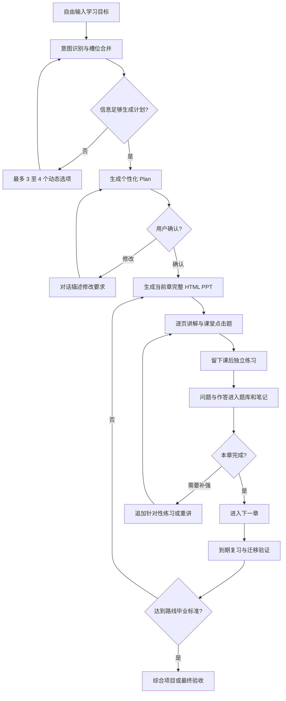
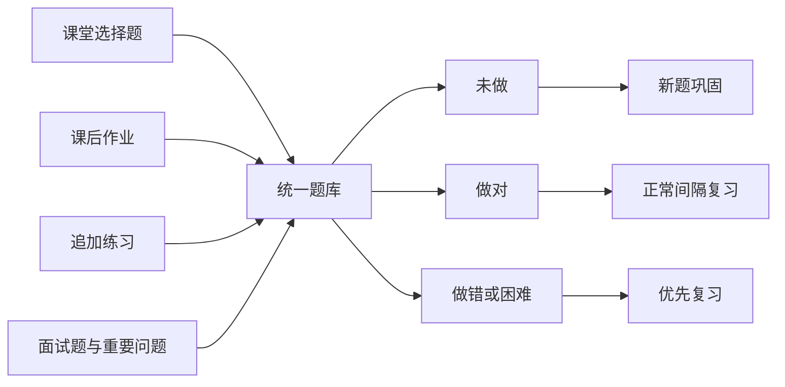

# Learning Agent 全场景工作流

> 更新日期：2026-08-24  
> 本文描述系统如何根据不同用户目标改变询问、计划、讲义、练习、复习和毕业标准。

## 1. 总工作流

## 2. 通用 Onboarding 工作流

1. 页面加载后读取本地学习项目，但不自动创建新课程。
2. 用户点击左侧旧项目即可继续；输入新目标则启动新意图识别。
3. 模型读取最近 8 条相关对话与已填槽位，输出结构化决策。
4. 已明确的内容不重复询问。
5. 缺失信息会影响路线时，在输入框上方给 3–4 个动态选项。
6. 用户也可直接输入更准确的描述覆盖选项。
7. 槽位足够后生成 Plan；Plan 未确认前不进入课程页面。

## 3. 概念速学

适用示例：“RAG 是什么意思？”“闭包解决什么问题？”

1. 识别为 `concept_clarity`。
2. 只在必要时确认“仅理解概念”还是“还要看代码实现”。
3. Plan 保持简短，通常包括直觉、工作流程、适用场景、误区和 1–2 道点击判断。
4. 讲义优先使用比喻、流程图和小例子。
5. 不默认询问每天学习多久，不强制创建长期项目或复习日程。
6. 用户继续追问代码时，再升级为实现路线。
7. 验收：能用自己的话说明它解决什么问题，并能判断一个使用场景是否合适。

## 4. 从零到工程师

适用示例：“从零系统学 Go，最终能独立做项目。”

1. 确认最终成果和每次可用时间；水平为零时不做冗长诊断。
2. Plan 必须覆盖环境、基础语法、运行机制、调试、测试、工程结构、并发、性能、安全和毕业项目。
3. 第一章包含软件安装、项目创建、运行命令和错误排查。
4. 每章生成完整讲义，课堂只做点击题，课后进入真实项目练习。
5. 基础知识做对后快速推进；密集知识增加解释页和练习题。
6. 错题、作业和重要问题进入统一题库。
7. 每日或按到期时间进行 Anki 式复习。
8. 最终独立完成一个包含测试、错误处理和复盘的大型项目。

## 5. 有一点基础或中级补全

1. 生成 3–4 道模型诊断题，最多不超过 10 道。
2. 已掌握部分在 Plan 中标记快速复习，不重复从零慢讲。
3. 薄弱点恢复小步讲解、代码演示和练习。
4. 通过迁移题验证是否真的掌握，而不是只看是否答对原题。
5. 同类错误重复出现时进入 `needs_review` 并缩短复习间隔。
6. 后半程逐渐提高到独立实现和工程取舍。

## 6. 紧急看懂项目

1. 用户提供项目根目录或目标仓库。
2. Plan 优先覆盖入口、模块边界、关键调用链、数据流和当前任务相关文件。
3. 只补充阻塞理解的语言与框架知识，不先上完整基础课。
4. 课堂题以代码阅读、输出预测和调用链判断为主。
5. 课后练习是在真实项目中完成一次小修改并运行相关测试。
6. Anki 练习保持轻量，优先记录项目术语和容易混淆的调用关系。
7. 验收：能说明一次请求如何流过系统，并独立修改一个目标位置。

## 7. 只想看懂语法或代码

1. 识别目标代码涉及的最小语法集合。
2. Plan 按代码出现顺序组织，不按语言教科书顺序铺开全部内容。
3. PPT 逐段展示代码、中文注释、运行结果和常见误读。
4. 使用选择题判断输出、类型和控制流。
5. 不强制大型项目；可用一个小文件完成课后练习。
6. 验收：能逐段解释目标代码并预测关键行为。

## 8. 项目实战交付

1. 先明确要交付的功能、技术约束和完成标准。
2. Plan 反向拆解里程碑，每个知识点必须服务于当前项目。
3. 系统在 `projects/<项目名>/` 建立真实目录结构。
4. 示例代码有中文注释，首个示例可提供；核心作业保留空白让用户独立完成。
5. 用户在编辑器运行、测试和调试，问题回到对话框讨论。
6. 题库记录架构选择、错误修复和关键知识，而不只记录语法题。
7. 验收：功能、测试、说明文档与复盘全部完成。

## 9. 高级工程师精进

1. 不从基础定义开始，先确认架构、性能、可靠性或团队工程目标。
2. Plan 使用一个足够大的项目贯穿全程。
3. 课程围绕设计取舍、边界、故障、性能、安全、可观测性和重构展开。
4. 练习以设计评审、故障演练、基准测试和迁移方案为主。
5. 对话评价重点是证据和取舍，不是是否使用某个固定答案。
6. 易错决策和复盘结论进入复习卡。
7. 验收：完成设计文档、实现、测试、指标与工程复盘。

## 10. 面试冲刺：已有题目

1. 用户通过文字或语音粘贴题目。
2. 系统保留原文，拆分、去重、分类并加入面试题库。
3. 用户选择逐题从头讲、系统学习或先测后学。
4. 没有答案的题生成参考答案、rubric、常见遗漏和追问。
5. PPT 先显示题目，用户思考或口述后再展开答案。
6. 用户按没想起来、困难、顺利记录掌握度。
7. 后续新增题目只调整待学内容，不倒退已获得的整体进度。
8. 最后进行两道实战题和一轮模拟面试。

## 11. 面试冲刺：没有题目

1. 根据目标岗位、技术栈、级别和时间生成知识框架。
2. 每章末尾自动生成 2–4 道高频简答题。
3. 每题提供 30–90 秒答案、回答结构、常见遗漏和追问答案要点。
4. 题目进入统一题库，按 Anki 方式复习。
5. 选择题只用于快速判断理解；主要训练口头简答和追问。
6. 最终用完整模拟面试检验表达、深度和临场追问。

## 12. 统一题库工作流

题库列表展示来源、状态、错误次数和下次复习日期。做错的题明确标记“再做一遍”。

## 13. Anki 复习工作流

1. 点击题库底部“开始复习”。
2. 后端选择最多 5 道到期或高优先级题。
3. 正面展示问题，答案保持隐藏。
4. 用户先回忆、口述或在对话中回答。
5. 点击“查看答案”，展示答案、解析、上次错误和关联知识。
6. 用户评价回忆难度：红色没想起来、黄色困难、绿色顺利。
7. 后端写入历史，并安排 1、3、7 天后的下一次复习。
8. 一张完成后自动进入下一张，结束后汇总薄弱点。

## 14. 对话追加练习工作流

1. 用户说“再出几道题”或点击相应快捷提示。
2. 系统读取当前知识点、课程目标和最近错误。
3. `practice-drill` 决定难度与训练重点，`quiz-designer` 输出 3–5 道题。
4. 后端验证题目、选项、答案和重复情况。
5. 题目写入题库并提示新增数量。
6. 用户可以立即开始做题或留到复习时间。

## 15. 知识库共创工作流

1. 新主题先查询已有知识原子和已验证讲义。
2. 缺失或版本敏感时检索权威资料，再生成教学内容。
3. 生成讲义通过结构、路径、答案和代码注释校验后进入缓存。
4. 有复用价值的重要问题进入 `curation/pending/`。
5. 维护者验证来源、示例和教学效果。
6. 通过 PR 合并为正式知识原子、路线或题目资产。
7. 个人学习数据和隐私内容不进入公共仓库。

## 16. 失败恢复

- 意图识别失败：保留用户输入，允许重试，不创建错误课程。
- Plan 生成失败：保留旧计划和已填槽位。
- 讲义生成失败：保留当前章节、页码和题库记录。
- 复习保存失败：答案和当前卡片不丢失，允许再次提交。
- 新项目切换失败：后端状态不提前覆盖旧项目。

## 17. 工作流验收

- 每种用户路线都能在 1–2 轮关键澄清后进入 Plan。
- Plan 未确认时不会生成第一章。
- 每章结束后有明确下一章入口。
- 课堂题、作业、追加题和面试题都能进入统一题库。
- 题库可以真正发起逐卡复习，而不是只记录一个泛化评价。
- 面试路线在没有用户题目时也能形成完整问题集和答案。
